# The Web3 通用型去中心化钱包(HD钱包)项目设计文档

# 一. 概述

本文档是一个通用型的去中心化钱包设计文档，我们知道的钱包如 ImToken, TokenPocket, Trust Wallet 和 MetaMask 等，他们的设计方式和这个文档里面设计方式大多都是类似。钱包有中心化钱包（也就是交易所钱包），去中心化钱包，硬件钱包（去中心化钱包和硬件钱包的设计方式都是 HD 钱包）和 MPC. 托管钱包等类别；在以太坊生态里面还有 Gnosis safe 和 AA 钱包。大家可能还听过社交恢复钱包，实际上，社交恢复这个功能在去中心化钱包，AA 钱包里面都可以正常去集成，在其他类型的钱包里面没有实际意义。

# 二. 项目架构

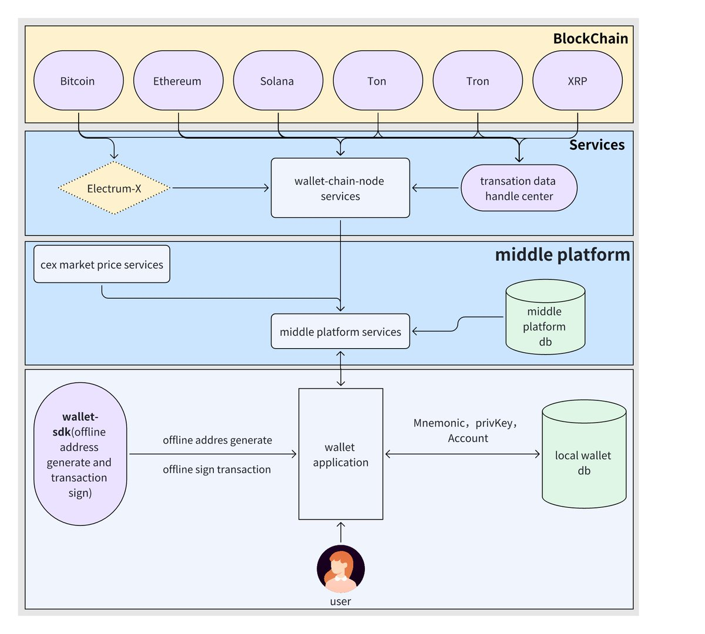

## **1.** **架构要点**

- BlockChain 层是钱包 RPC 节点
- Services 层是钱包的数据处理，例如比特币的和地址相关的 UTXO 处理，根据地址获取历史交易记录的处理等 ElectrumX:  处理比特币的数据服务，这个是一个开源项目 Wallet-chain-node: 这个是 The Web3 实现的一个统一的钱包 RPC 服务层 Transaction Handle: 交易数据处理器，地址相关的交易处理等，一般可以用第三方服务，如 oklink 和浏览器数据服务
- middle platform: 中台服务是钱包的对接各服务模块，并且还是活动，dapp, 咨询等管理模块的服务端，上层对接统一 RPC 服务，对接 CEX 行情服务等。 CEX 行情服务：The Web3 社区实现了一个 skyeye 项目，对接了所有中心化交易所行情和主流的去中心化交易所行情供钱包使用。 middle platform services: 承接钱包的前端和后端的一个中间层服务，同时还是活动，dapp, 咨询等管理模块的服务端
- APP 端：钱包的核心功能所在 wallet-sdk:  The Web3 社区实现多链离线地址生成和离线签名的 SDK 项目 本地数据库：用户存储加密的助记词编码，私钥，账户信息等

## 2. The Web3 社区项目

- Wallet sdk: The Web3 社区实现的 wallet-sdk 项目，目前并未开源； https://github.com/the-web3/wallet-sdk

- Hailstone: The Web3 社区实现的中台项目项目,目前并未开源； https://github.com/the-web3/hailstone

- Wallet-chain-node: The Web3 社区实现统一钱包 RPC 接口，目前已经开源； https://github.com/the-web3/wallet-chain-node

- Skyeye: The Web3 社区实现的行情服务，目前已开源； https://github.com/the-web3/skyeye

- Parapack: The Web3 社区实现的一个 RN 开发的 HD 钱包，目前已开源； https://github.com/the-web3/parapack


# 三. 功能模块

## **1.生成助记词和验证助记词**

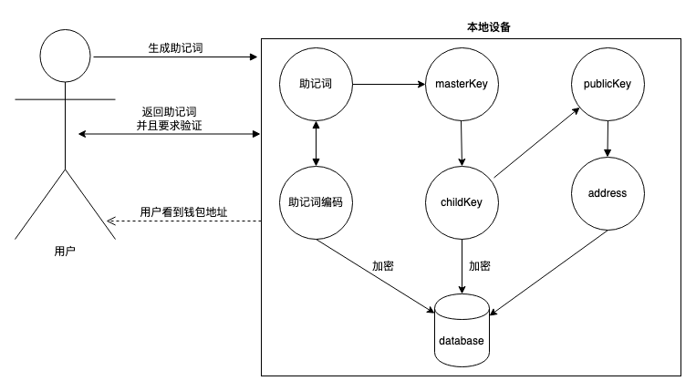

## **2. 导出助记词和私钥**

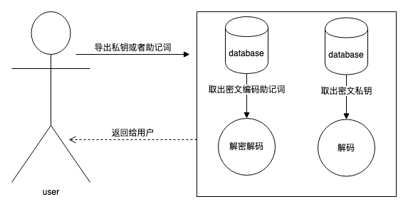

## **3. 导入助记词和私钥**

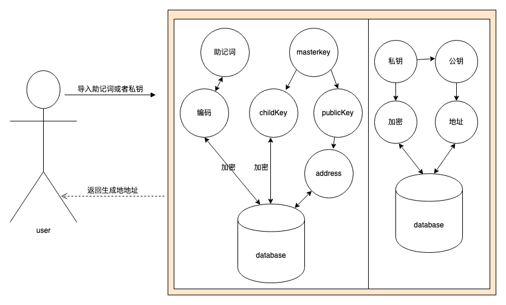

## **4. 转账背后的秘密**

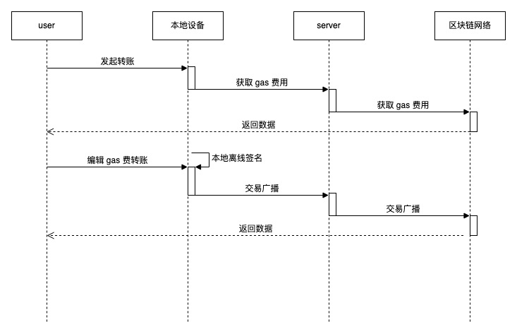

## **5. 查看余额和交易记录**

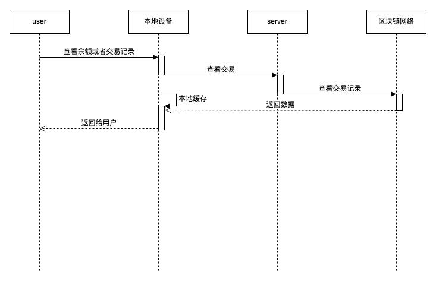

## **6. 行情模块**

**6.1. 业务架构图**

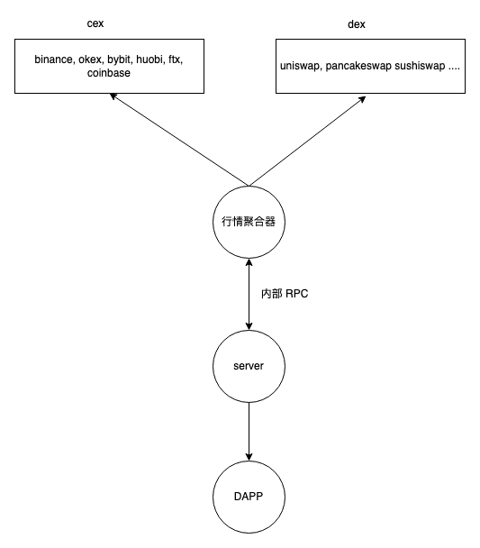

**6.2.业务流程图**

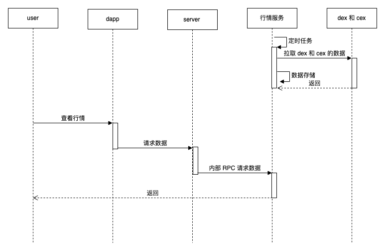

## 7.DAPP 模块

**7.1.业务架构图**

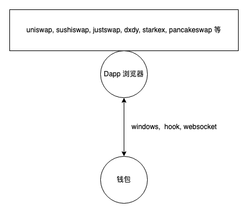

**7.2.业务流程图**

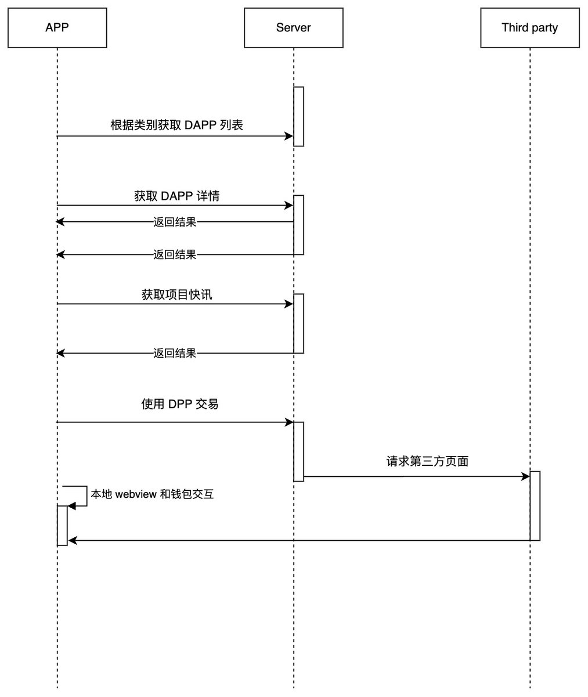

# 四. 钱包 APP 端数据表设计

## 1.**数据库**

- 选用 sqlite3
- rn(nodejs 操作数据库)

## 2,**表结构设计(后端服务也可以复用钱包相关的表结构)**

2.1.**链表**

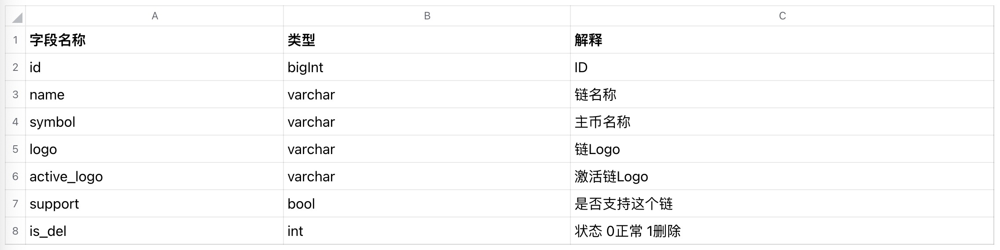

2.2.**资产表**

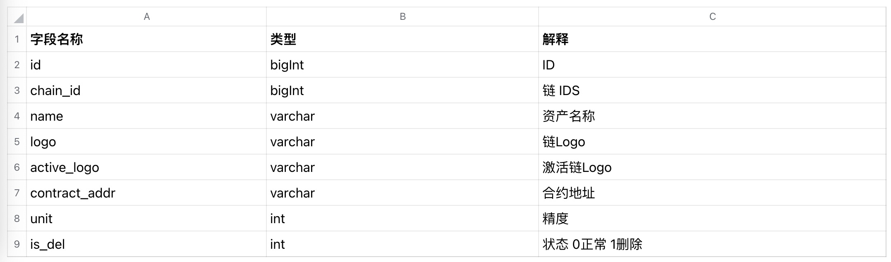

创建钱包主币的时候添加，搜索 Token 添加的时候往里面加数据

2.3.**钱包表**

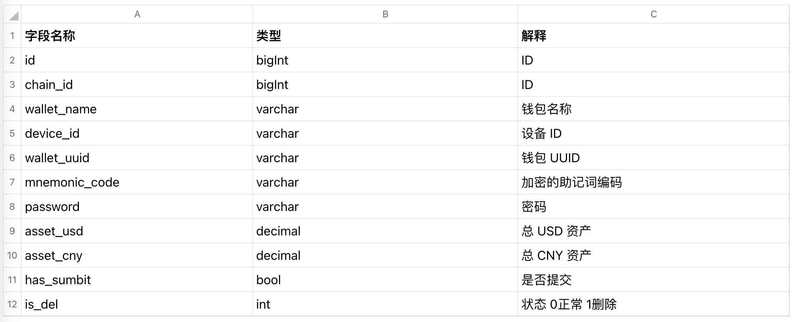

只有创建主币的时候添加钱包，如果 asset_usd 和 asset_cny 和接口返回不一样的时候，需要更新 asset_usd 和 asset_cny

2.4.**钱包资产表**

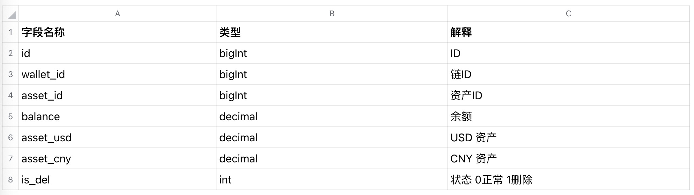

创建主币和添加代币的是关联钱包资产余额

2.5.**账户表(账户相当于地址)**


创建钱包时候添加，添加 index 为 1-n 的时候需要去添加

2.6.**账户资产表(账户相当于地址)**

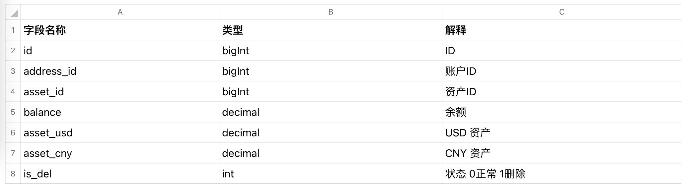

创建钱包时候添加，其他时候更新

2.7.**加密算法**

- 采用对称加密算法 AES，加密的 Key 为设备 ID + 用户输入的密码

**2.8.操作方法**

**2.8.1.APP** **启动时**

- APP 启动时做一次初始化，把默认值支持的链和币种初始化到表

**2.8.2.生成账户**

- 生成助记词->验证助记词->验证通过->助记词编码存储到助记词表 助记词生成 seed-> Masterkey -> bip44 协议-> child privateKey -> publicKey->Address, 将地址对应的 Bip 协议的索引(默认 0)，私钥加密和公钥存储到账户表里面，并请求一次余额更新到表里。检测手机是否连网，如果连网，不断请求余额更新。

2.8.3.**导出助记词和私钥**

导出助记词->查询助记词表->得到助记词编码之后解密返回给界面 导出私钥->查询账户表->得到私钥后解密返回给界面

2.8.4.**导入助记词和私钥**

- 导入助记词->验证助记词->验证通过->助记词编码存储到助记词表
- 助记词 seed-> Masterkey -> bip44 协议-> child privateKey -> publicKey->Address, 将地址对应的 Bip 协议的索引(默认 0)，私钥加密和公钥存储到账户表里面，并请求一次余额更新到表里。检测手机是否连网，如果连网，不断请求余额更新。
- 导入私钥-> privateKey -> publicKey->Address, 将地址对应的 Bip 协议的索引(默认 0)，私钥加密和公钥存储到账户表里面，并请求一次余额更新到表里。检测手机是否连网，如果连网，不断请求余额更新。

2.8.5.**获取余额**

- 检测手机是否连网，如果连网，不断请求余额更新。

2.8.6.**转账**

- 发起转账-> 组织交易数据-> 从账户表里拿到 privateKey->交易签名->更新交易到交易表->广播交易->检测交易状态更新到交易记录表

2.8.7.**获取交易记录**

- 检测手机是否连网，如果连网，不断请求交易记录更新。

# 五. 后端数据库 Model 设计

## 1.Wallet Model

```python
class Wallet(BaseModel):
    chain = models.ForeignKey(
        Chain, on_delete=models.CASCADE,
        related_name="wallet_chain",
        null=True, blank=True,
        verbose_name='chain'
    )
    device_id = models.CharField(max_length=70, verbose_name='device id')
    wallet_uuid = models.CharField(max_length=70, verbose_name='wallet uuid')
    wallet_name = models.CharField(max_length=70, verbose_name='wallet name')
    asset_usd = DecField(default=d0, verbose_name="total usd")
    asset_cny = DecField(default=d0, verbose_name="total cny")

class WalletAsset(BaseModel):
    wallet = models.ForeignKey(
        Wallet, on_delete=models.CASCADE,
        related_name="wallet_asset_wallet",
        null=True, blank=True,
        verbose_name='wallet'
    )
    asset = models.ForeignKey(
        Asset, on_delete=models.CASCADE,
        null=True, blank=True,
        related_name="wallet_asset_asset",
        verbose_name='asset'
    )
    contract_addr = models.CharField(max_length=70, verbose_name='contract address')
    asset_usd = DecField(default=d0, verbose_name="wallet usd")
    asset_cny = DecField(default=d0, verbose_name="wallet cny")
    balance = DecField(default=d0, verbose_name="wallet balance")


class Address(BaseModel):
    wallet = models.ForeignKey(
        Wallet, on_delete=models.CASCADE,
        null=True, blank=True,
        related_name="wallet_address",
        verbose_name='wallet'
    )
    index = models.CharField(max_length=10, verbose_name='address index', db_index=True)
    address = models.CharField(max_length=70, verbose_name='address')


class AddressAsset(BaseModel):
    wallet = models.ForeignKey(
        Wallet, on_delete=models.CASCADE,
        related_name="address_asset_wallet",
        null=True, blank=True,
        verbose_name='wallet'
    )
    asset = models.ForeignKey(
        Asset, on_delete=models.CASCADE,
        related_name="address_asset_asset",
        null=True, blank=True,
        verbose_name='asset'
    )
    address = models.ForeignKey(
        Address, on_delete=models.CASCADE,
        related_name="address_asset_address",
        null=True, blank=True,
        verbose_name='address'
    )
    asset_usd = DecField(default=d0, verbose_name="address usd")
    asset_cny = DecField(default=d0, verbose_name="address cny")
    balance = DecField(default=d0, verbose_name="address balance")


class AddressAmountStat(BaseModel):
    address = models.ForeignKey(
        Address, on_delete=models.CASCADE,
        null=True, blank=True,
        verbose_name='address'
    )
    amount = DecField(default=d0, verbose_name="amount")
    timedate = models.CharField(max_length=70, verbose_name='timedate')


class TokenConfig(BaseModel):
    chain = models.ForeignKey(
        Chain, on_delete=models.CASCADE,
        null=True, blank=True,
        verbose_name='chain name'
    )
    asset = models.ForeignKey(
        Asset, on_delete=models.CASCADE,
        null=True, blank=True,
        verbose_name='asset name'
    )
    token_name = models.CharField(max_length=70, verbose_name='token name')
    token_symbol = models.CharField(max_length=70, verbose_name='Token symbol')
    contract_addr = models.CharField(max_length=70, verbose_name='contract address')
    decimal = models.CharField(max_length=10, verbose_name='token decimal', db_index=True)
    is_hot = models.CharField(
        max_length=32,
        choices=BoolYesOrNoSelect,
        default='no',
        verbose_name="is_hot asset"
    )


class TxRecord(BaseModel):
    chain = models.ForeignKey(
        Chain, on_delete=models.CASCADE,
        null=True, blank=True,
        verbose_name='chain name'
    )
    asset = models.ForeignKey(
        Asset, on_delete=models.CASCADE,
        null=True, blank=True,
        verbose_name='asset name'
    )
    from_addr = models.CharField(max_length=70, verbose_name='sender')
    to_addr = models.CharField(max_length=70, verbose_name='reviver')
    amount = DecField(default=d0, verbose_name="amount")
    memo = models.CharField(max_length=70, verbose_name='memo')
    hash = models.CharField(max_length=70, verbose_name='hash')
    block_height = models.CharField(max_length=70, verbose_name='block_height')
    tx_time = models.CharField(max_length=70, verbose_name='tx_time')


class AddresNote(BaseModel):
    chain = models.ForeignKey(
        Chain, on_delete=models.CASCADE,
        null=True, blank=True,
        verbose_name='chain name'
    )
    asset = models.ForeignKey(
        Asset, on_delete=models.CASCADE,
        null=True, blank=True,
        verbose_name='asset name'
    )
    device_id = models.CharField(max_length=70, verbose_name='device id')
    memo = models.CharField(max_length=70, verbose_name='memo')
    address = models.CharField(max_length=70, verbose_name='address')


class WalletHead(BaseModel):
    wallet = models.ForeignKey(
        Wallet, on_delete=models.CASCADE,
        null=True, blank=True,
        verbose_name='wallet'
    )
    wallet_head = models.CharField("wallethead", max_length=512)
```

## 2.行情 model

```python
class Exchange(BaseModel):
    name = models.CharField(
        max_length=100,
        unique=True,
        verbose_name='交易所名称'
    )
    config = models.TextField(
        blank=True,
        verbose_name='配置信息'
    )
    market_type = models.CharField(
        max_length=100,
        choices=ExchangeCate,
        default="Cex",
        verbose_name='交易所类别'
    )
    status = models.CharField(
        max_length=100,
        choices=CommonStatus,
        default='Active',
        verbose_name='状态'
    )

    class Meta:
        verbose_name = 'Exchange'
        verbose_name_plural = verbose_name

    @property
    def is_active(self) -> bool:
        return self.status == 'Active'

    @property
    def is_down(self) -> bool:
        return not self.is_active

    def __str__(self):
        return self.name

    def as_dict(self):
        return {
            'id': self.id,
            'name': self.name,
            'market_type': self.market_type,
            'status': self.status
        }


class Symbol(BaseModel):
    name = models.CharField(
        max_length=100,
        unique=True,
        verbose_name='交易对名称'
    )
    icon = models.ImageField(upload_to='symbol/%Y/%m/%d/', blank=True, null=True)
    base_asset = models.ForeignKey(
        Asset, blank=True,
        related_name='base_symbols',
        null=False,
        on_delete=models.CASCADE,
        verbose_name='base资产'
    )
    quote_asset = models.ForeignKey(
        Asset, blank=True,
        related_name='quote_symbols',
        null=False,
        on_delete=models.CASCADE,
        verbose_name='报价资产'
    )
    status = models.CharField(
        max_length=100,
        choices=CommonStatus,
        default='Active',
        verbose_name='状态'
    )
    category = models.CharField(
        max_length=100,
        choices=SymbolCat,
        default="Spot"
    )

    class Meta:
        verbose_name = 'Symbol'
        verbose_name_plural = verbose_name

    def __str__(self):
        return self.name


class MarketPrice(BaseModel):
    symbol = models.ForeignKey(
        Symbol, related_name='price_symbol',
        null=True, blank=True,
        on_delete=models.CASCADE
    )
    exchange = models.ForeignKey(
        Exchange, related_name='price_exchange',
        null=True, blank=True,
        on_delete=models.CASCADE
    )
    base_asset = models.ForeignKey(
        Asset, related_name='base_relate_asset',
        null=True, blank=True,
        on_delete=models.CASCADE
    )
    qoute_asset = models.ForeignKey(
        Asset, related_name='qoute_relate_asset',
        null=True, blank=True,
        on_delete=models.CASCADE
    )
    sell_price = DecField(default=0)
    buy_price = DecField(default=0)
    usd_price = DecField(default=0)
    cny_price = DecField(default=0)
    avg_price = DecField(default=0)
    margin = DecField(default=0)

    class Meta:
        verbose_name = 'MarketPrice'
        verbose_name_plural = verbose_name

    def as_dict(self):
        if self.margin >= d0:
            margin = '+' + str(format(self.margin, ".2f")) + '%'
        else:
            margin = '-' + str(format(self.margin, ".2f")) + '%'
        return {
            'id': self.id,
            'symbol': self.symbol.name,
            'exchange': self.exchange.name,
            'icon': str(self.symbol.icon),
            'base_asset': self.base_asset.name,
            'qoute_asset': self.qoute_asset.name,
            'sell_price': format(self.sell_price, ".4f"),
            'buy_price': format(self.buy_price, ".4f"),
            'avg_price': format(self.avg_price, ".4f"),
            'usd_price': format(self.usd_price, ".4f"),
            'cny_price': format(self.cny_price, ".4f"),
            'margin': margin,
        }


class StablePrice(BaseModel):
    asset = models.ForeignKey(
        Asset, related_name='otc_asset',
        null=True, blank=True,
        on_delete=models.CASCADE
    )
    usd_price = DecField(default=0)
    cny_price = DecField(default=0)

    class Meta:
        verbose_name = 'StablePrice'
        verbose_name_plural = verbose_name

    def as_dict(self):
        return {
            'asset': self.asset.name,
            'usd_price': format(self.usd_price, ".4f"),
            'cny_price': format(self.cny_price, ".4f")
        }


class FavoriteMarket(BaseModel):
    device_id = models.CharField(max_length=70, verbose_name='设备ID')
    market_price = models.ForeignKey(
        MarketPrice, related_name='symbol_market_price',
        null=True, blank=True,
        on_delete=models.CASCADE
    )

    class Meta:
        verbose_name = 'FavoriteMarket'
        verbose_name_plural = verbose_name

    def as_dict(self):
        return {
            'id': self.id,
            'device_id': self.device_id,
            'market_price': self.market_price.as_dict()
        }
```

## 3.Dapp 数据库 Model

```python
class Dapps(BaseModel):
    name = models.CharField(max_length=70, verbose_name='Dapp名字')
    link = models.CharField(max_length=500, verbose_name='Dapp uri 链接')
    type = models.CharField(
        max_length=100,
        choices=CommonStatus,
        default='Hot',
        verbose_name='dapp 类别'
    )
    detail = models.CharField(max_length=800, verbose_name='Dapp 详细介绍')

    class Meta:
        verbose_name = 'Dapps'
        verbose_name_plural = verbose_name

    def as_dict(self):
        return {
            'id': self.id,
            'name': self.name,
            'link': self.link,
            'type': self.type,
            'detail': self.detail
        }
```

## 3.其他 Model

- 其他模块，各个钱包有自己的业务实现形式，我们只讲解通用部分，不通用部分这里不做过多的赘述。

# 六. 接口设计

## 1.钱包相关的接口

**1.1.根据地址查 balance**

- 请求参数

```text
{
    "device_id": "1111111221",
    "wallet_uuid": "222222111",
    "index":"0",
    "chain": "Arbitrum",
    "symbol": "USDT",
    "network": "mainnet",
    "address": "0x98E9D288743839e96A8005a6B51C770Bbf7788C0",
    "contract_address": "0x0000000000000000000000000000"
}
```

- 返回值

```text
{
    "ok": true,
    "code": 200,
    "result": {
        "balance": "6.1126",
        "asset_usd": "6.1126",
        "asset_cny": "42.7879",
        "data_stat": []
    }
}
```

**1.2.查询钱包余额度**

- 请求参数

```text
{
    "device_id": "100220112ea",
    "wallet_uuid": "20122310101",
    "chain": "Ethereum"
}
```

- 返回值

```text
{
    "ok": true,
    "code": 200,
    "result": {
        "chain": "Arbitrum",
        "network": "mainnet",
        "device_id": "1111111221",
        "wallet_uuid": "222222111",
        "wallet_name": "yueyue",
        "asset_usd": "0.0000",
        "asset_cny": "0.0000",
        "token_list": [
            {
                "id": 9,
                "symbol": "ETH",
                "logo": "wallet/2022/11/13/虎符智能链_h.png",
                "contract_addr": "",
                "balance": "0.0000",
                "asset_usd": "0.00",
                "asset_cny": "0.00",
                "address_list": [
                    {
                        "id": 9,
                        "index": "0",
                        "address": "0x98E9D288743839e96A8005a6B51C770Bbf7788C0",
                        "balance": "0.0000",
                        "asset_usd": "0.00",
                        "asset_cny": "0.00"
                    },
                    {
                        "id": 10,
                        "index": "1",
                        "address": "0x98E9D288743839e96A8005a6B51C770Bbf7788C0",
                        "balance": "1.0000",
                        "asset_usd": "1.00",
                        "asset_cny": "1.00"
                    }
                ]
            },
            {
                "id": 10,
                "symbol": "USDT",
                "logo": "wallet/2022/11/15/虎符智能链_h.png",
                "contract_addr": "0xdAC17F958D2ee523a2206206994597C13D831ec7",
                "balance": "1.0000",
                "asset_usd": "1.00",
                "asset_cny": "1.00",
                "address_list": [
                    {
                        "id": 9,
                        "index": "0",
                        "address": "0x98E9D288743839e96A8005a6B51C770Bbf7788C0",
                        "balance": "6112556512368236419.0000",
                        "asset_usd": "6.11",
                        "asset_cny": "42.79"
                    },
                    {
                        "id": 10,
                        "index": "1",
                        "address": "0x98E9D288743839e96A8005a6B51C770Bbf7788C0",
                        "balance": "0.0000",
                        "asset_usd": "0.00",
                        "asset_cny": "0.00"
                    }
                ]
            }
        ]
    }
}
```

**1.3.提交钱包信息**

- 请求参数

```text
{
    "chain": "Arbitrum",
    "symbol": "ETH",
    "network": "mainnet",
    "device_id": "111111qqq1",
    "wallet_uuid": "22222qq2",
    "wallet_name": "shijiaaaang1",
    "index": "0",
    "address": "0x0000000000000000000000000000000",
    "contract_addr": "0x0000000000000000000000000000000"
}
```

- 返回值

```text
{
    "ok": true,
    "code": 200,
    "result": "submit wallet success"
}
```

**1.4.批量提交钱包信息**

- 请求参数

```text
{
    "batch_wallet": [
        {
            "chain": "eth",
            "symbol": "eth",
            "network": "mainnet",
            "device_id": "aaa",
            "wallet_uuid": "qqqq",
            "wallet_name": "sss",
            "index": "0",
            "address": "0x0000000000000000000000000000000",
            "contract_addr": "0x0000000000000000000000000000000"
        }
    ]
}
```

- 返回值

```text
{
    "ok": true,
    "code": 200,
    "result": "batch submit wallet success"
}
```

**1.5.获取钱包资产**

- 请求参数

```text
{
    "device_id": "1111111221"
}
```

- 返回值

```text
{
    "ok": true,
    "code": 200,
    "result": {
        "total_asset_usd": "0.0000",
        "total_asset_cny": "0.0000",
        "token_list": [
            {
                "wallet_name": "yueyue",
                "wallet_balance": [
                    {
                        "id": 9,
                        "symbol": "ETH",
                        "logo": "wallet/2022/11/13/虎符智能链_h.png",
                        "contract_addr": "",
                        "balance": "0.0000",
                        "asset_usd": "0.00",
                        "asset_cny": "0.00",
                        "address_list": [
                            {
                                "id": 9,
                                "index": "0",
                                "address": "0x98E9D288743839e96A8005a6B51C770Bbf7788C0",
                                "balance": "0.0000",
                                "asset_usd": "0.00",
                                "asset_cny": "0.00"
                            },
                            {
                                "id": 10,
                                "index": "1",
                                "address": "0x98E9D288743839e96A8005a6B51C770Bbf7788C0",
                                "balance": "1.0000",
                                "asset_usd": "1.00",
                                "asset_cny": "1.00"
                            }
                        ]
                    },
                    {
                        "id": 10,
                        "symbol": "USDT",
                        "logo": "wallet/2022/11/15/虎符智能链_h.png",
                        "contract_addr": "0xdAC17F958D2ee523a2206206994597C13D831ec7",
                        "balance": "1.0000",
                        "asset_usd": "1.00",
                        "asset_cny": "1.00",
                        "address_list": [
                            {
                                "id": 9,
                                "index": "0",
                                "address": "0x98E9D288743839e96A8005a6B51C770Bbf7788C0",
                                "balance": "6112556512368236419.0000",
                                "asset_usd": "6.11",
                                "asset_cny": "42.79"
                            },
                            {
                                "id": 10,
                                "index": "1",
                                "address": "0x98E9D288743839e96A8005a6B51C770Bbf7788C0",
                                "balance": "0.0000",
                                "asset_usd": "0.00",
                                "asset_cny": "0.00"
                            }
                        ]
                    }
                ]
            }
        ]
    }
}
```

**1.6.更新钱包名称**

- 请求参数

```text
{
    "device_id": "1111111221",
    "wallet_uuid": "222222111",
    "wallet_name": "yueyue"
}
```

- 返回值

```text
{
    "ok": true,
    "code": 200,
    "result": "update wallet name success"
}
```

**1.7.删除钱包**

- 请求参数

```text
{
    "device_id": "test111111111",
    "wallet_uuid": "test222222",
    "chain": "Arbitrum"
}
```

- 返回值

```text
{
    "ok": true,
    "code": 200,
    "result": "delete wallet success"
}
```

**1.8.删除钱包 Token**

- 请求参数

```text
{
    "device_id": "test111111111",
    "wallet_uuid": "test222222",
    "chain": "Arbitrum",
    "symbol": "USDT",
    "contract_addr": "0x000"
}
```

- 返回值

```text
{
    "ok": true,
    "code": 200,
    "result": "delete wallet success"
}
```

## 2. 行情模块接口

**2.1.根据交易类别获取交易所**

- 请求方式：POST
- API 名称：api/get_exchanges
- 请求示范

```text
{
   "type": "Cex",    Cex: central exchange; Dex: dex
}
```

- 返回值

```text
{
    "ok": true,
    "code": 200,
    "result": [
        {
            "id": 1,
            "name": "binance",
            "market_type": "Cex",
            "status": "Active"
        },
        {
            "id": 2,
            "name": "okex",
            "market_type": "Cex",
            "status": "Active"
        }
    ]
}
```

**2.2.根据交易所获取行情信息**

- 请求方式：POST
- API 名称：api/get_exchange_market
- 请求示范

```text
{
   "exchange_id": 1,
   "device_id": 0
}
```

- 返回值

```text
{
    "ok": true,
    "code": 200,
    "result": [
        {
            "id": 1,
            "symbol": "ETH/USDT",
            "base_asset": "USDT",
            "qoute_asset": "ETH",
            "sell_price": "1323.0200",
            "buy_price": "1323.0300",
            "avg_price": "1323.0250",
            "usd_price": "1323.0250",
            "cny_price": "9234.7145",
            "margin": "0.23"
        },
        {
            "id": 3,
            "symbol": "BTC/USDT",
            "base_asset": "USDT",
            "qoute_asset": "BTC",
            "sell_price": "19331.0800",
            "buy_price": "19331.7200",
            "avg_price": "19331.4000",
            "usd_price": "19331.4000",
            "cny_price": "134933.1720",
            "margin": "0.23"
        }
    ]
}
```

**2.3. 添加收藏**

- 请求方式：POST
- API 名称：api/add_favorite_market
- 请求示范

```text
{
   "device_id": "00000",
   "market_id": 2
}
```

- 返回值

```text
{
    "ok": false,
    "code": 4000,
    "msg": "no this market_price"
}
```

**2.4.移除收藏**

- 请求方式：POST
- API 名称：api/remove_favorite_market
- 请求示范

```text
{
   "device_id": "00000",
   "market_id": 2
}
```

- 返回值

```text
{
    "ok": false,
    "code": 4000,
    "msg": "no this market_price"
}
```

## 3.Dapp 模块接口

- 请求方式：POST
- API 名称：api/get_dapp_list
- 请求示范

```text
{
   "type": "all"
}
```

- 返回值

```text
{
    "ok": true,
    "code": 200,
    "result": [
        {
            "id": 1,
            "name": "uniswap",
            "link": "https://app.uniswap.org/swap",
            "type": "Hot",
            "detail": "uniswap uniswap uniswap uniswap"
        },
        {
            "id": 1,
            "name": "uniswap",
            "link": "https://app.uniswap.org/swap",
            "type": "Hot",
            "detail": "uniswap uniswap uniswap uniswap"
        }
    ]
}
```

# 七. 总结

本文档仅仅是一个开发示例文档，所属的内容只是包含 HD 钱包的通用部分的设计思路，这仅仅是 The Web3 社区的设计思路，并代表任何其他项目方的观点。

文档中的代码和接口仅仅展示了局部的东西，并不是整个项目的全貌，如果你有非常强烈的兴趣了解这个项目，建议您联系 The Web3 社区技术开发咨询，或者成为 The Web3 社区区块链技术培训课程的学生，你将有更多的资料和The Web3 社区课程讲师支持去学习研究本项目。