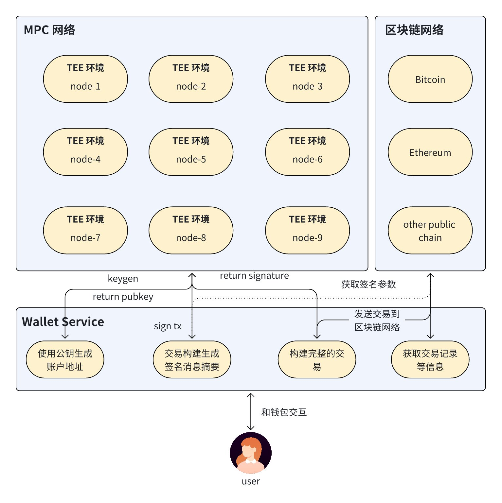
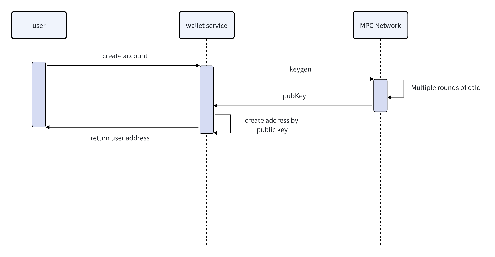
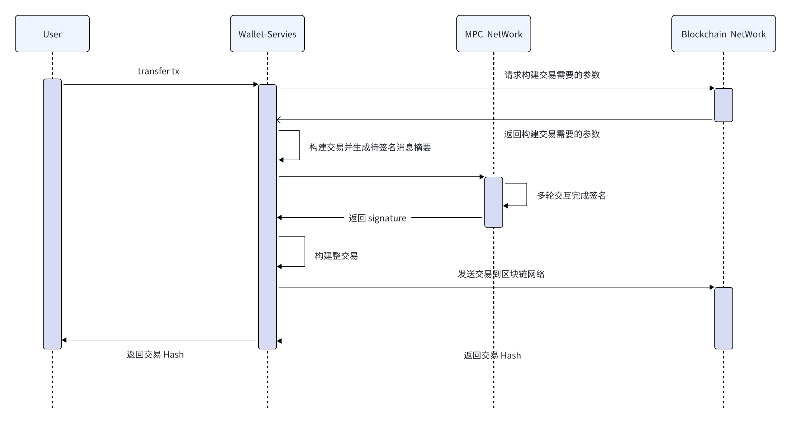
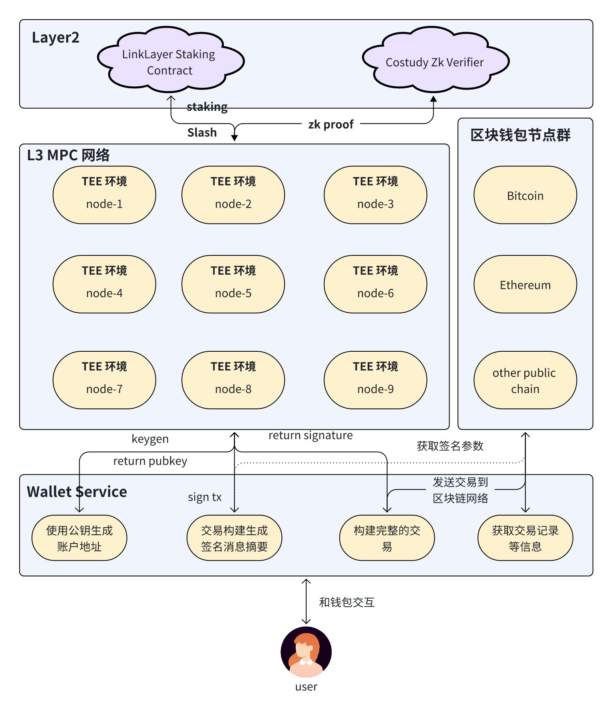

# The Web3 通用型 MPC 资管系统项目设计方案

# 一. 概述

目前市场上有很多公司在做 MPC 资管系统，也有很多公司使用 MPC 资管平台； 当然，现在市场上也有很多自托管的 MPC 钱包，其中不乏用户量比较大的钱包。因此，不管是从开发者角度，还是从 MPC 托管钱包系统使用者角度，理解整个系统的运行都是非常有必要的。对于技术开发者来说，学会该项技术，将能为你未来的职业生涯增加另一份可能性；对于使用者来说，深入理解该系统的运行机制才能选择到更好的托管产品，为自己的资金服务。

## 1.什么 MPC

安全多方计算（Secure Multi-Party Computation，SMPC 或 MPC）是一种密码学技术，允许多个参与方在没有信任第三方的情况下，协同计算某个函数的结果，同时确保每个参与方的输入数据对其他参与方保密，也就是说 MPC 各参与方持有的密钥只有自己知道。同时 MPC 签名的特点是网络中有 M 个节点，N 个节点参与签名交易就有效(M >= N)。

1.1. 安全多方计算的基本概念

- **多方参与**：有多个参与方，每个参与方拥有私密输入数据。
- **联合计算**：参与方希望共同计算一个公共函数的输出，但不希望泄露各自的私密输入。
- **隐私保护**：在计算过程中，确保每个参与方的输入数据对其他参与方是保密的。

1.2.安全多方计算的主要特性

- **输入隐私性**：保证各方输入数据的隐私性，即使在计算过程中也不会泄露给其他参与方。
- **正确性**：保证计算结果的正确性，确保输出结果是按照协议正确计算的。
- **公平性**：所有参与方同时得到计算结果，没有任何一方能够提前获得或影响结果。
- **安全性**：即使在某些参与方恶意行为或尝试获取额外信息的情况下，协议仍然能够保障输入数据的隐私性和计算结果的正确性。

1.3.安全多方计算的基础

- **秘密分享（Secret Sharing）**：将数据分割成多份，使得单个分片不泄露任何信息，只有足够多的分片集合才能重建原始数据。典型的有 Shamir 秘密分享方案。
- **混淆电路（Garbled Circuits）**：一种基于电路的计算方式，使用混淆技术对布尔电路进行加密，使得参与方能够在不知道具体电路结构的情况下进行计算。
- **同态加密（Homomorphic Encryption）**：一种加密方法，允许在加密数据上直接执行特定的运算，而不需要解密。常见的同态加密方案包括 Paillier 加密和 Gentry 的全同态加密方案。
- **可信执行环境（Trusted Execution Environment，TEE）**：一种硬件和软件结合的技术，提供隔离的执行环境来确保代码和数据的机密性和完整性。

## 2.什么是托管系统

MPC 托管系统（MPC Custody）是一种基于安全多方计算（Secure Multi-Party Computation，MPC）技术的资产托管解决方案。它的整个网络中没有出现过完整的私钥，节点之间通过多轮计算得到聚合公钥，各个私钥托管方密钥片是私密的，密钥片分布在不同的托管方之间，从而提高了数字资产的安全性和管理灵活性。

2.1.MPC 托管系统的基本原理

- **密钥分片**：私钥被分割成多个密钥片（key shares），这些密钥片分别存储在不同的服务器或设备上。单个密钥片本身不包含任何有用的信息，只有在足够数量的密钥片聚合时，才能恢复出完整的私钥。
- **分布式签名**：在需要进行数字签名时，MPC 托管系统会通过多方计算协议，使用各自持有的密钥片来联合生成签名。这个过程中，私钥本身不会被重构或暴露给任何单一方。
- **无信任第三方**：每个托管方之间可以相互不信任，但通过 MPC 协议，仍然可以保证计算的正确性和密钥的安全性。

2.2.MPC 托管系统的主要特性

- **增强的安全性**：由于密钥分布在多个地方，即使一个托管方遭受攻击，攻击者也无法获得完整的私钥，从而大大提高了系统的安全性。
- **去中心化管理**：消除了单点故障的风险，提高了系统的鲁棒性和可靠性。
- **灵活的访问控制**：可以设置多种策略（如多签名、多因子认证）来控制对密钥的访问和使用。
- **隐私保护**：私钥不会在任何时刻被完整地重建，确保了密钥的隐私性。

## 3.MPC 钱包类别

- 自托管钱包：密钥分片由用户和钱包服务商控制
- 企业托管钱包：密钥分片有不同的机构节点控制

# 二.项目架构



## 1.架构要点说明：

- Keygen 过程：用户向系统发起托管地址申领请求，钱包服务接收到这个请求之后，想 MPC 网络发起 keygen 过程，MPC 网络通过多轮交互之后，个节点产生了账户对应的密钥片，同时产生聚合公钥，用聚合公钥生成地址，这个地址即为用户地址。
- Sign 过程：用户发起转账请求，钱包服务收到转账请求之后，构建待签名的交易，将该交易 Hash 成待签名的消息摘要，将消息摘要递给 MPC 网络进行签名，假定 MPC 节点为 M，N 个节点签名有效(M >= N), N 个节点签名完成之后返回 signature。
- 交易发送到区块链网络：用签名完成返回来 signature 和交易信息，公钥等构造完整的交易，将完整的交易发送到区块链网络。

## 2.重要说明

很多 MPC 自托管钱包的 MPC 密钥片一般会给到用户，我们假定三片密钥，用户本地设备里面有一片，剩下的两片一般会让用户备份到云端，谷歌或者其他云盘里面；大家使用 MPC 自托管钱包的时候应该都会遇到让你备份密钥的过程。

# 三.功能模块

## 1.账户生成



## 2.交易签名并且发送交易到区块链网络



# 四. 基于 ZenGo-X 的 multi-party-ecdsa 实现 Ethereum MPC 钱包 MVP

本节我们将按照上面的流程用 ZenGo-X 的 multi-party-ecdsa 实现一个 Ethereum MPC 托管钱包 MPC，这里由于是 MVP， 我们将不给大家展示完整的源码，只讲一个简单的实现流程和代码片段，**如果您想获得 MPC 托管钱包的实战代码，请联系 The Web3 社区获取，代码目前这个阶段并不开源，可能需要付一定费用才能拿到实战的源码。**

下面我们基于 multi-party-ecdsa  的 example，并结合以太坊签名交易特征完成项目的 MVP 练习。

## 1.生成账户地址

将 multi-party-ecdsa 的代码库编译构建之后，启动 gg20 manager,  命令如下：

```text
./gg20_sm_manager
```

模拟三个节点 keygen, 命令如下：

```text
./gg20_keygen -t 1 -n 3 -i 1 --output local-share1.json
./gg20_keygen -t 1 -n 3 -i 2 --output local-share2.json
./gg20_keygen -t 1 -n 3 -i 3 --output local-share3.json
```

生成的 keygen 文件里面有一个叫 y_sum_s 的字段，这里面的 point 对应的就是三个节点掌管的私钥对应的公钥，通过下面代码可以生成地址，代码如下：

```text
const y_sum_s = [
    3, 51, 74, 205, 71, 16, 34, 12, 190, 49, 191, 131,
    245, 158, 114, 173, 238, 162, 120, 125, 221, 191,
    128, 106, 146, 177, 243, 86, 18, 254, 233, 50, 118
];
const address = ethers.utils.computeAddress("0x" + Buffer.from(y_sum_s).toString("hex"))
console.log("wallet address:", address);
```

## 2.交易签名

构建交易，可以构建任意类型的交易，构建 *Legacy 类型*

```rust
let tx = TransactionRequest {
    chain_id: Option::from(U64::from(10)),
    to: Some(NameOrAddress::from(wallet.address())),
    value: Some(U256::from(100000000000u64)), // 1 ETH
    gas: Some(U256::from(21000)),
    gas_price: Some(U256::from(10000000000u64)), // 20 Gwei
    nonce: Some(U256::from(0)),
    ..Default::default()
};
```

如果想构建 EIP1559 交易，使用下面代码

```rust
let tx1559 = Eip1559TransactionRequest {
    chain_id: Option::from(U64::from(10)),
    to: Some(NameOrAddress::from(wallet.address())),
    value: Some(U256::from(100000000000u64)), // 1 ETH
    gas: Some(U256::from(21000)),
    max_fee_per_gas: Some(U256::from(10000000000u64)), // 20 Gwei
    max_priority_fee_per_gas: Some(U256::from(10000000000u64)), // 20 Gwei
    nonce: Some(U256::from(0)),
    ..Default::default()
};
```

构建待签名的消息摘要,  代码如下：

```rust
let chain_id = tx.chain_id().map(|id| id.as_u64()).unwrap_or(self.chain_id);
let mut tx = tx.clone();
tx.set_chain_id(chain_id);

let sighash = tx.sighash();

println!("Tx Sign Hash: {:?}", sighash);
```

将 sign hash 拿去给 MPC 网络签名

```text
./gg20_signing -p 1,2 -d "sighash" -l local-share1.json
./gg20_signing -p 1,2 -d "sighash" -l local-share2.json
```

使用 r, s 构建完整的交易

```rust
let signed_tx = Transaction {
    hash: Default::default(),
    nonce: U256::from(0),
    block_hash: None,
    block_number: None,
    transaction_index: None,
    gas_price: Option::from(U256::from(10000000000u64)),
    gas: U256::from(21000),
    to: Option::from(wallet.address()),
    value: U256::from(100000000000u64),
    v: U64::from(signature.v),
    r: signature.r,
    s: signature.s,
    transaction_type: None,
    access_list: None,
    max_priority_fee_per_gas: None,
    max_fee_per_gas: None,
    chain_id: None,
    from: Default::default(),
    input: Default::default(),
    other: Default::default(),
};

println!("{:?}", signed_tx.rlp());
```

从签名信息里面恢复地址代码如下：

```js
const convertHashToHex = (value) => {
    return value.map(v => v.toString(16).padStart(2, '0')).join('');
}

const r = "0x" + convertHashToHex([38,197,206,18,56,101,23,224,63,131,52,210,1,129,193,227,250,26,43,168,54,154,241,18,51,125,21,186,218,126,144,249])
const s = "0x" + convertHashToHex([33,26,215,163,100,30,208,235,66,20,231,175,68,154,183,100,230,211,218,117,115,71,118,238,183,162,169,117,76,61,103,179])
const recid = 0
const expandedSig = {
    r: r,
    s: s,
    v: recid
}
const recoveredAddress = ethers.utils.recoverAddress(Buffer.from("f87fde81fd3fa0e152252a45467b32faeac8377b4e6580c9ac06cc6ee82240bb"), expandedSig)
console.log(recoveredAddress);
```

## 3.发送交易到区块链网络

将上面签名得到的消息发送到区块链网络

请求示范

```text
curl --location 'https://eth-mainnet.g.alchemy.com/v2/XZw9s8EsSyUtwDOjtVvzwL8N0T96Zxt0' \
--header 'Content-Type: application/json' \
--header 'Cookie: _cfuvid=A7vae8DmfdNdKLQ37u_mDw17rqRDDuKqXFrJuWD1ccA-1716725090138-0.0.1.1-604800000' \
--data '{
    "jsonrpc":"2.0",
    "method":"eth_sendRawTransaction",
    "params":["0x"],
    "id":1
}'
```

返回值

```text
{
    "jsonrpc": "2.0",
    "id": 1,
    "error": {
        "code": -32000,
        "message": "typed transaction too short"
    }
}
```

返回值为交易 Hash

# 五. DappLink Layer3 托管模块解决方案

上面我们讲解了目前市场上存储的托管模块的解决方案，从实际情况出发，上面的 MPC 托管钱包是存在安全风险, 由于 MPC keygen 和 Sign 的过程都涉及到多轮计算，这个网络节点过于庞大的话，整个 keygen 和 sign 的效率就越低。所以，目前的 MPC 托管钱包的节点群都很小，而且节点都是掌握在不同项目方的手里，用户有可能持有一些节点，有可能没有持有节点。这种情况下若节点运营商联合作恶，是完全可以窃取用户的资产的。

DappLink 考虑到了上述这些情况，我设计了  L3 托管 AppChain, 提高安全的同时不影响 MPC 签名的效率，DappLink 主要做了一下改进

- 节点运行商必须在 DappLink 的 LinkLayer 多重质押协议质押一定量的 ETH 才能运行 MPC 托管节点，节点做恶，质押的 ETH 将会被罚没
- 每次签名的节点动态选出，参与签名的节点需提交承诺签名信息到 L2,  动态委员信息，交易信息等将生成 zk proof 提交到 L2, 这个过程中若发现做恶节点，罚没质押。

架构图如下：



# 六. 资料链接

- ZenGo-X ECDSA 多方计算库:  https://github.com/ZenGo-X/multi-party-ecdsa
- ZenGo-X BLS 多方计算库：https://github.com/ZenGo-X/multi-party-bls
- ZenGo-X EDDSA多方计算代码库：https://github.com/ZenGo-X/multi-party-eddsa
- BNB Chain 门限签名代码库： https://github.com/bnb-chain/tss-lib
- DappLink Github: https://github.com/eniac-x-labs
- DappLink X:  https://x.com/0xdapplink