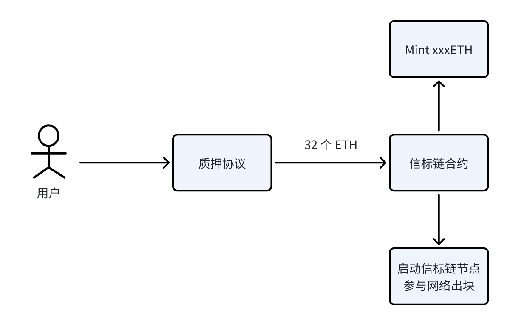
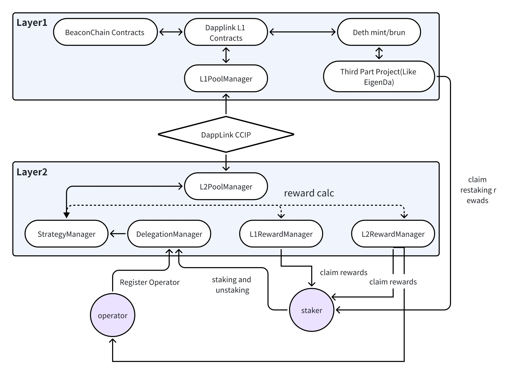
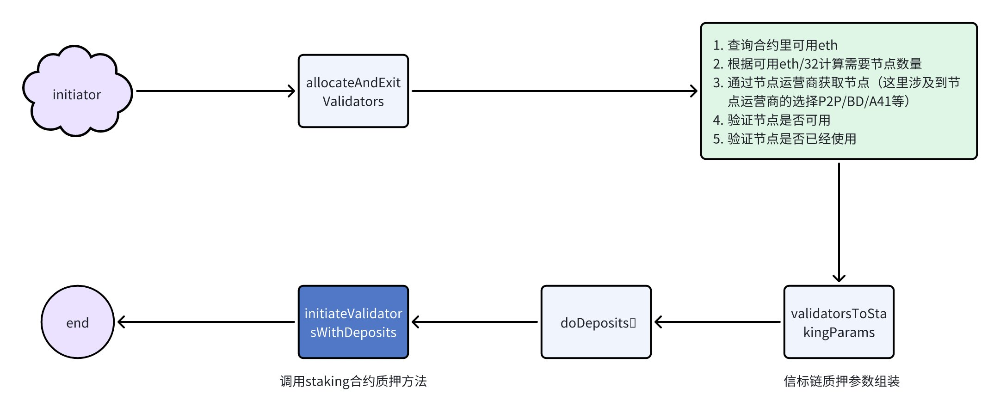
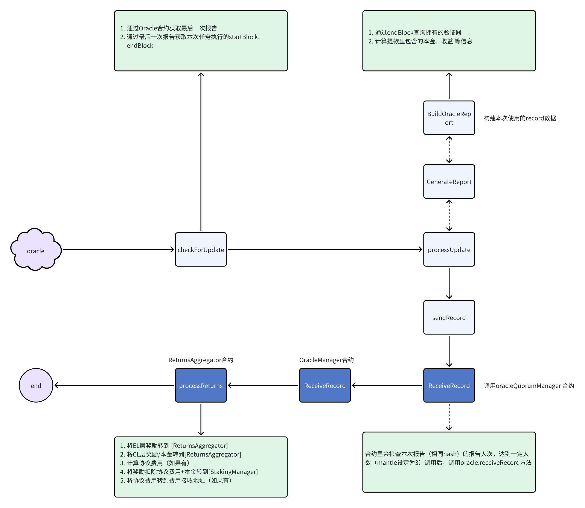
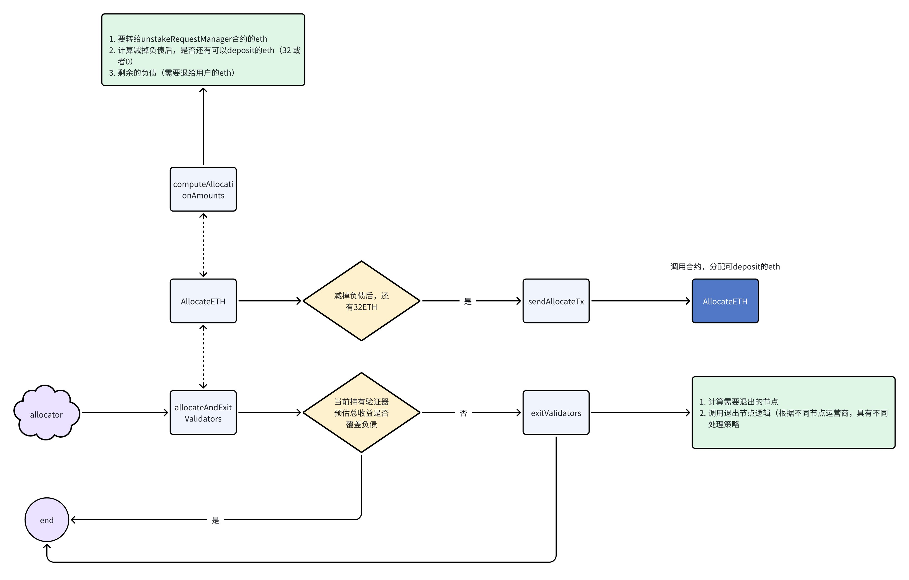

# 如何在钱包里面实现 Staking 功能

# 一. Staking 功能概述

Staking 是一种数字货币领域中常见的机制，允许持有者通过将其加密货币锁定在特定的区块链网络中，从而获得奖励。这种机制通常用于支持和维护区块链网络的运行和安全。

## 1.基本概念

- **定义**：Staking 是指持有者将其加密货币存入一个指定的钱包或智能合约中，并锁定一段时间，以支持区块链网络的操作。
- **目的**：通过 staking，持有者可以帮助区块链网络进行交易验证和达成共识，从而确保网络的安全和稳定。

## 2.**主要特点**

- **收益**：参与 staking 的持有者可以获得奖励，通常以同种加密货币或其他形式的收益发放。这些奖励可能是固定的，也可能是根据网络的具体规则动态变化的。
- **锁定期**：在 staking 期间，加密货币将被锁定一段时间，期间持有者无法转移或使用这些加密货币。锁定期长短因区块链网络的不同而有所差异。
- **最低持有量**：有些区块链网络对参与 staking 的持有量有最低要求，持有者必须至少持有一定数量的加密货币才能参与 staking。

## 3.质押类别

- **权益证明（Proof of Stake, PoS）**：这是最基本的 staking 机制，节点通过持有和锁定加密货币来参与网络共识 💡ETH2.0 

  💡Cosmos（ATOM） 

  💡Solanan（SOL）

- **委托权益证明（Delegated Proof of Stake, DPoS）**：持有者将其加密货币委托给可信任的节点（代表），由代表进行验证和共识操作。 

  💡Tezos（XTZ） 

  💡EOSIO（EOS） 

  💡TRON（TRX）

- **混合机制**：一些区块链网络使用混合机制，例如混合 PoW/PoS（工作量证明和权益证明结合），以平衡网络的安全性和去中心化特性。

- **智能合约**：通过智能合约实现的质押模型 

  💡EigenLayr 

  💡DappLink 多重质押协议 LinkLayer 

  💡Compond

## 4.**工作原理**

- **验证节点**：在使用权益证明（Proof of Stake，PoS），其变种的区块链和合约实现的质押协议网络中，验证节点（或称为 staker）通过锁定其加密货币来获得验证交易和创建新区块的权利。
- **选取机制**：验证节点的选取通常是随机的，但选取概率与节点所持有的加密货币数量成正比，一般持有越多的加密货币，成为验证节点的概率越大， ETH2.0 是比较特殊的，持有 32 个 ETH 成为验证人，大于 32 个 ETH 部分不会获得更多的奖励。
- **奖励机制**：验证节点成功验证交易并创建新区块后，会获得相应的奖励。这些奖励的来源可以是区块链网络生成的新币或交易费用。

## 5.**优缺点分析**

**优点**

- **收益来源**：持有者可以通过 staking 获得被动收入。
- **网络安全**：通过 staking，更多的持有者参与网络共识，提高了区块链网络的安全性和去中心化程度。
- **资源效率**：相比于工作量证明（Proof of Work, PoW），staking 更加节能和环保，不需要大量的计算资源。

**缺点**

- **流动性风险**：由于加密货币在 staking 期间被锁定，持有者可能面临流动性不足的问题。
- **市场风险**：加密货币市场价格波动较大，持有者的 staking 收益可能无法抵消价格下跌带来的损失。
- **集中化风险**：在某些情况下，持有大量加密货币的大户可能控制网络，导致集中化问题。

# 二. 课程说明

本课程将围绕 ETH2.0,  Solana 和 Tezos 展开，由于这里讲解的内容和 staking 的底层实现逻辑并没有太大的关系，因此本课程不会深入讲解 Staking 的底层实现机制，而是仅仅讲解钱包层面和 staking 相关的内容。接下来我们将围绕着 Ethereum2.0, Solana 和 Tezos 展开本课程的内容。

# 二.  ETH2.0 staking

以太坊 2.0（Ethereum 2.0），也被称为 ETH2 或 Serenity，是以太坊区块链的一个重大升级，旨在改善可扩展性、安全性和可持续性。ETH2的核心目标是通过引入新的共识机制（称为权益证明）以及分阶段的部署来解决当前以太坊网络面临的一系列问题。

以下是ETH2的一些主要特性和改进：

- **权益证明（PoS）机制**：ETH2将从以太坊1.0的工作量证明（PoW）共识机制转变为权益证明（PoS）共识机制。在PoS中，验证者通过抵押一定数量的ETH来参与网络的验证和区块生产，而不是像PoW中那样依赖大量的计算资源来解决数学难题。
- **分阶段部署**：ETH2的升级是分阶段进行的。第一个阶段称为Beacon Chain，它引入了PoS共识机制，并与现有的以太坊1.0链平行运行。随后的阶段将逐步引入区块链合并、分片技术等功能，以进一步提高网络的性能和可扩展性。
- **分片技术**：在ETH2中，分片是将整个区块链状态和交易处理分成小片段的技术。这样做可以提高网络的吞吐量，允许更多的交易并行处理，从而提高整个系统的性能。
- **网络安全和可持续性**：通过引入PoS共识机制，ETH2旨在提高网络的安全性，并降低对能源的消耗。相较于PoW，PoS能够降低对能源的需求，并且更加环保。
- **奖励和激励机制**：参与ETH2网络的验证者（即持有者）可以通过提供安全性和参与区块生产来获得奖励。这些奖励主要是通过区块的交易费和新铸造的ETH来实现的。

总的来说，以太坊2.0的目标是建立一个更加可扩展、安全和可持续的区块链网络。通过引入PoS共识机制、分片技术等创新，ETH2旨在解决以太坊1.0中存在的各种问题，并为未来的去中心化应用提供更好的基础设施。

## 1.ETH 2.0 质押介绍

在 ETH2.0 中，共识算法是 POS，信标链负责共识模块，每质押 32 个 ETH 可以启动一个信标链节点, 现在有很多 LSD 协议专门做 ETH 质押的，例如：lido,  swell, mantle-lsd 等项目，也有从二层质押回去，1 层的模式类似这些 LSD 项目的，这里以 DappLink 的 LinkLayr 多重质押协议为例给大家讲解整个流程。

**1.1.正常 LSD 质押流程**



**1.2.DappLink 的 LinkLayer 质押协议**



**1.3.LinkLayer 一层质押模型角色**

**质押流程**



**资金归集**



**退出节点**



**1.4代码实战**

- https://github.com/eniac-x-labs/linklayer
- https://github.com/eniac-x-labs/dapplink-services

## 2.钱包里面实现 ETH 质押功能

钱包只需要找对应的 LSD 项目合作，通过 call 合约的方式把资金丢到 LSD 项目里面就可以

# 三.  Solana(SOL) Staking

## 1.Solana 质押概述

Solana 区块链上的质押是指将一定数量的 SOL 代币锁定在网络上，以支持网络的安全性和稳定性，并获得相应的奖励。以下是 Solana 质押的一些概述：

- **质押奖励**：通过在 Solana 网络上质押 SOL 代币，有机会获得相应的奖励。这些奖励主要来自于网络的通胀机制和交易费用。
- **网络安全**：质押 SOL 代币有助于确保 Solana 网络的安全性和去中心化。质押者通过参与网络的验证和共识过程来保护网络免受恶意攻击和攻击者的影响。
- **质押池**：Solana 网络通常会有多个质押池（staking pool）可供选择，质押者可以选择将其 SOL 代币放入这些池子中，而不必自行运行验证节点。质押池通常提供更简单的质押体验，并可能提供更广泛的奖励分配方式；各大钱包公司都提供了可供选择的质押节点。
- **质押门槛**：参与 Solana 质押通常需要达到一定的门槛，即需要锁定一定数量的 SOL 代币才能参与质押。质押门槛的具体要求可能会因质押池或网络协议而异。
- **退出质押**：质押者可以随时选择退出质押并解锁其质押的 SOL 代币。但在某些情况下，可能需要一定的解锁期限或过程才能完全退出质押并取回所有的代币。

总的来说，Solana 质押是参与 Solana 网络并为其安全性和稳定性做出贡献的一种方式，同时也是一种获取奖励的机会。质押者应该对网络的运行机制和质押奖励等方面有一定的了解，并在决定参与质押之前进行适当的研究和考虑。

## 2.Solana 质押离线签名

**2.1.创建质押账号并质押资金**

```js
export async function createAccount() {
    let tx = new Transaction();
    const priv = "privateKey"
    const fromPublicKey = Keypair.fromSecretKey(new Uint8Array(Buffer.from(priv, "hex")));
    let stakeAccount = Keypair.generate();
    const secretKey = stakeAccount.secretKey
    let secretKeyHex = Buffer.from(secretKey).toString('hex');
    let authorizedAccount = fromPublicKey;
    let lamportsForStakeAccount = 12388800;
    let createAccountTransaction = StakeProgram.createAccount({
        fromPubkey: fromPublicKey.publicKey,
        authorized: new Authorized(authorizedAccount.publicKey, authorizedAccount.publicKey),
        lamports: lamportsForStakeAccount,
        lockup: new Lockup(0, 0, fromPublicKey.publicKey),
        stakePubkey: stakeAccount.publicKey
    });
    tx.add(createAccountTransaction)
    tx.recentBlockhash = "F7i9vw8taJvVJntB7nV8CMf4tNskmxwnLJSCFosGgofZ";
    tx.sign(fromPublicKey, stakeAccount);
    const serializeMsg = tx.serialize().toString("base64");
    console.log("serializeMsg====", serializeMsg)
}
```

**2.2.转移质押投票权**

```js
export async function delegateStake() {
    let tx = new Transaction()
    const priv1 = "privateKey-1"
    const authorizedAccount = Keypair.fromSecretKey(new Uint8Array(Buffer.from(priv1, "hex")));
    const priv2 = "privateKey-2"
    const stakeAccount = Keypair.fromSecretKey(new Uint8Array(Buffer.from(priv2, "hex")));
    let votePubkey = new PublicKey("FKsC411dik9ktS6xPADxs4Fk2SCENvAiuccQHLAPndvk");
    let delegateTransaction = StakeProgram.delegate({
        stakePubkey: stakeAccount.publicKey,
        authorizedPubkey: authorizedAccount.publicKey,
        votePubkey: votePubkey,
    });
    tx.add(delegateTransaction)
    tx.recentBlockhash = "Hq6d9jBrs6RHtAbFFy4beYPjx6fggVKETeeahC9jBPGK";
    tx.sign(authorizedAccount, stakeAccount);
    const serializeMsg = tx.serialize().toString("base64");
    console.log("serializeMsg====", serializeMsg)
}
```

2.3.解除账号活跃状态

```js
export function deactivateStake() {
    let tx = new Transaction()
    const priv1 = "privateKey-1"
    const authorizedAccount = Keypair.fromSecretKey(new Uint8Array(Buffer.from(priv1, "hex")));
    const priv2 = "privateKey-2"
    const stakeAccount = Keypair.fromSecretKey(new Uint8Array(Buffer.from(priv2, "hex")));
    let deactivateTransaction = StakeProgram.deactivate({
        stakePubkey: stakeAccount.publicKey,
        authorizedPubkey: authorizedAccount.publicKey,
    });
    tx.add(deactivateTransaction)
    tx.recentBlockhash = "AScJ4TVPF26EF82mLtv5R5SJYgCB3FhaHnLVEAdjKtx7";
    tx.sign(authorizedAccount, stakeAccount);
    const serializeMsg = tx.serialize().toString("base64");
    console.log("serializeMsg====", serializeMsg)
}
```

2.4.提取质押的资金

```js
export function withdrawFunds() {
    let tx = new Transaction()
    const priv1 = "privateKey-1"
    const authorizedAccount = Keypair.fromSecretKey(new Uint8Array(Buffer.from(priv1, "hex")));
    const priv2 = "privateKey-2"
    const stakeAccount = Keypair.fromSecretKey(new Uint8Array(Buffer.from(priv2, "hex")));
    const priv = "privateKey-1"
    const fromPublicKey = Keypair.fromSecretKey(new Uint8Array(Buffer.from(priv, "hex")));
    const stakeBalance = 1010592
    let withdrawTransaction = StakeProgram.withdraw({
        stakePubkey: stakeAccount.publicKey,
        authorizedPubkey: authorizedAccount.publicKey,
        toPubkey: fromPublicKey.publicKey,
        lamports: stakeBalance,
    });
    tx.add(withdrawTransaction)
    tx.recentBlockhash = "2453A3Kep5d1kmoNP5p5i9NPhmhZANe7q6rDU8TUPRqj";
    tx.sign(authorizedAccount, stakeAccount);
    const serializeMsg = tx.serialize().toString("base64");
    console.log("serializeMsg====", serializeMsg)
}
```

## 3.Solana 质押相关的 RPC 接口

**3.1.获取可以进行质押的节点**

- 请求示范

```text
curl --location 'https://sly-yolo-dinghy.solana-mainnet.quiknode.pro/2ac2af5b8c2e5e9e74c7906e949f1976314aa996' \
--header 'Content-Type: application/json' \
--data ' {
    "jsonrpc": "2.0", 
    "id": 1,
    "method": "getClusterNodes"
  }'
```

- 返回值：

```text
{
    "jsonrpc": "2.0",
    "result": [
        {
            "featureSet": 3746964731,
            "gossip": "216.144.245.62:8001",
            "pubkey": "BmR3ANrUw8aKEnh9a7wBMXAoT1MKtXYsYqWQxQ7sdHmL",
            "pubsub": null,
            "rpc": null,
            "shredVersion": 50093,
            "tpu": "216.144.245.62:8004",
            "tpuQuic": "216.144.245.62:8010",
            "version": "1.17.34"
        }
     ],
    "id": 1
}
```

- pubkey:  节点公钥，质押 delegate 的时候签名需要用

**3.2.获取 Epoch 信息**

- 请求示范

```text
curl --location 'https://sly-yolo-dinghy.solana-mainnet.quiknode.pro/2ac2af5b8c2e5e9e74c7906e949f1976314aa996' \
--header 'Content-Type: application/json' \
--data ' {
    "jsonrpc": "2.0", 
    "id": 1,
    "method": "getEpochInfo"
  }'
```

- 返回值

```text
{
    "jsonrpc": "2.0",
    "result": {
        "absoluteSlot": 271176477,
        "blockHeight": 250804509,
        "epoch": 627,
        "slotIndex": 312477,
        "slotsInEpoch": 432000,
        "transactionCount": 294818991055
    },
    "id": 1
}
```

- epoch：为当前时期

**3.3.发送交易到区块链网络**

- 请求示范

```text
curl --location 'https://sly-yolo-dinghy.solana-mainnet.quiknode.pro/2ac2af5b8c2e5e9e74c7906e949f1976314aa996' \
--header 'Content-Type: application/json' \
--data '{
    "jsonrpc": "2.0",
    "id": 1,
    "method": "sendTransaction",
    "params": [
      "ASG4jVQEsZhgMGnkXIYEvyhvGMYBfwL8lFd40mPz4AjpeWqZlVM122Vx8iCZIUNmbGdqDcdplm0xMUGri4WiCAIBAAEDOns4dLpGe+a4HqNh49dFOvi4HIiu3SS1Ax/doLxxrTJa8yfsHKLzR/zaYPv8xS5VGKfAp4PkO8pQN4Jn396IRgAAAAAAAAAAAAAAAAAAAAAAAAAAAAAAAAAAAAAAAAAAKy6/vKD5x9Dmbz1bBJ85fYZK94CfRhjYwMBlQyb4mz8BAgIAAQwCAAAAQEIPAAAAAAA=",
      {
        "encoding":"base64"
      }
     
    ]
  }'
```

- 返回值

```text
{
    "jsonrpc": "2.0",
    "result": "g6yMJUd16jAcPiQfi7QK1M5tN7yheeKAC7NbUh3BQCSfav3pgv74ovCSGuhgApzma1s6ew8WEmX1Bzfk6sCfg9P",
    "id": 1
}
```

# 四.  Tezos(XTZ) Staking

Tezos质押（Staking）是一种通过参与Tezos区块链共识机制来获得奖励的方式。质押的过程包括锁定一定数量的Tezos代币（XTZ）以支持网络的安全和操作，并获得相应的回报。以下是关于Tezos质押的一些关键点：

## 1.**Tezos质押**

Tezos质押是指持有者将其XTZ代币锁定在网络中，以参与区块链的共识机制。Tezos使用一种称为“Liquid Proof-of-Stake”（LPoS）的共识算法，这种算法允许代币持有者通过质押来参与网络治理和区块验证。

**1.1. 参与方式**

质押Tezos可以通过两种主要方式进行：

- **自我质押（Self-Baking）**：用户自己运行一个Tezos节点，并直接参与区块验证。这种方式需要一定的技术知识和硬件支持。
- **委托质押（Delegation）**：用户将他们的XTZ代币委托给一个专业的Baker（质押服务提供者），由后者代表他们参与区块验证。用户仍然保有其代币的所有权，只是将其质押权委托出去。

**1.2. 质押的好处**

- **获得奖励**：参与质押可以获得XTZ代币奖励，奖励的数量取决于质押的数量和时间。
- **网络安全**：质押帮助增强Tezos区块链的安全性和稳定性。
- **参与治理**：质押者可以参与Tezos网络的治理，投票决定网络升级和其他重要事项。

**1.3. 风险与考虑**

- **技术要求**：自我质押需要一定的技术能力和设备维护。
- **托管风险**：委托质押涉及将代币委托给第三方，有一定的托管风险。
- **市场波动**：XTZ代币的市场价格波动可能影响质押奖励的实际价值。

**1.4.质押流程**

- **自我质押**： 设置并运行一个Tezos节点。 锁定一定数量的XTZ代币作为质押。 参与区块验证并获得奖励。
- **委托质押**： 选择一个可信赖的Baker。 在钱包中将XTZ代币委托给该Baker。 等待奖励分配。

## 2.Tezos 质押离线签名

```js
export async function StakingSign({ txObj, privs }): Promise<string> {
    const {from, delegate, counter, branch, fee, gasLimit, storageLimit } = txObj;
    const fromAddress = from;
    if (!privs[0] || !privs[0].key || privs[0].key === "") {
        throw new Error(`交易签名缺少私钥`);
    }
    const privKey: string = privs[0].key.substring(0, 64);
    const encodedPrivKey = encodePrivKey(privKey);
    const signer = new InMemorySigner(encodedPrivKey);
    var rpcOperations: RPCDelegateOperation[] = [];
    var revealOp: RPCDelegateOperation;
    revealOp = {
        kind: OpKind.DELEGATION,
        source: fromAddress,
        fee: fee,
        gas_limit: gasLimit,
        storage_limit: storageLimit,
        delegate: delegate
    }
    rpcOperations.push(revealOp);
    const preparedOp = prepareOp(branch, counter,  {
        operation: rpcOperations,
        source: fromAddress,
    });
    const opObLst:PreparedOperation = {
        opOb: preparedOp.opOb,
        counter: counter
    }
    const forgedBytes = await forge(opObLst);
    const signed = await sign(forgedBytes.opbytes, signer);
    console.log(signed.prefixSig)
    return signed.sbytes;
}
```

## 3.Tezos 质押相关的 RPC 接口

**3.1.获取烘焙师列表**

- 请求示范

```text
curl --location 'https://rpc.tzbeta.net/chains/main/blocks/head/helpers/baking_rights'
```

- 返回值

```text
[
    {
        "level": 5780818,
        "delegate": "tz1aRoaRhSpRYvFdyvgWLL6TGyRoGF51wDjM",
        "round": 0,
        "estimated_time": "2024-06-11T09:48:30Z",
        "consensus_key": "tz1aRoaRhSpRYvFdyvgWLL6TGyRoGF51wDjM"
    },{
        "level": 5780818,
        "delegate": "tz2FCNBrERXtaTtNX6iimR1UJ5JSDxvdHM93",
        "round": 60,
        "estimated_time": "2024-06-11T12:26:00Z",
        "consensus_key": "tz2FCNBrERXtaTtNX6iimR1UJ5JSDxvdHM93"
    }
]
```

- delegate：接受投票权限的烘焙师的地址

3.2.发送交易

- 请求示范

```text
curl -X POST "http://localhost:8732/injection/operation?async=false&chain=main" \
     -H "Content-Type: application/octet-stream" \
     --data-binary "6d5b0460a74cbca8b5bb4f97fd0cf6a0282c1ff8ded5180f3a98b1303bea6e846e00c42c5e588c3c6685e78ed2cc287ba1561698440d8c03a8aeb71dcc0800ff00fe9ceee394b26880e978fd409967f8c0d84c923a2c02be2874309f9105ef0aa31ef3c74f57735bf71ec6e0e9cbdc2c068a5093f7afd37f459871a75fd8e000836158ba4dbe08d3632f864df093c877c9fee05f03"
```

- 返回值

💡💡交易 Hash

# 五. 总结

我们都知道，在交易所（如 Binance, Bybit 和 Okx）还有很多 HD 钱包（如 Metamask 和 phantom ）里面都集成了 staking 的功能，由此看出，整个 staking 的在钱包开发中是比较重要的一环；熟悉 staking 的开发流程，也将帮助你更了解 staking 的一些本质性的东西。我们整个课程由 Eth2.0, Solana 和 Tezos 质押展开， ETH2.0 质押产品 LSD 开发的复杂度是比较高的 ，但是对于钱包接入来说，只需要对接 LSD 合约就行，开发起来是比较简单的， 当然，Solana 和 Tezos 质押在钱包开发中也比较简单，其他链的开发也和他们大同小异，因此我们本课程中也不再展开说明了。

