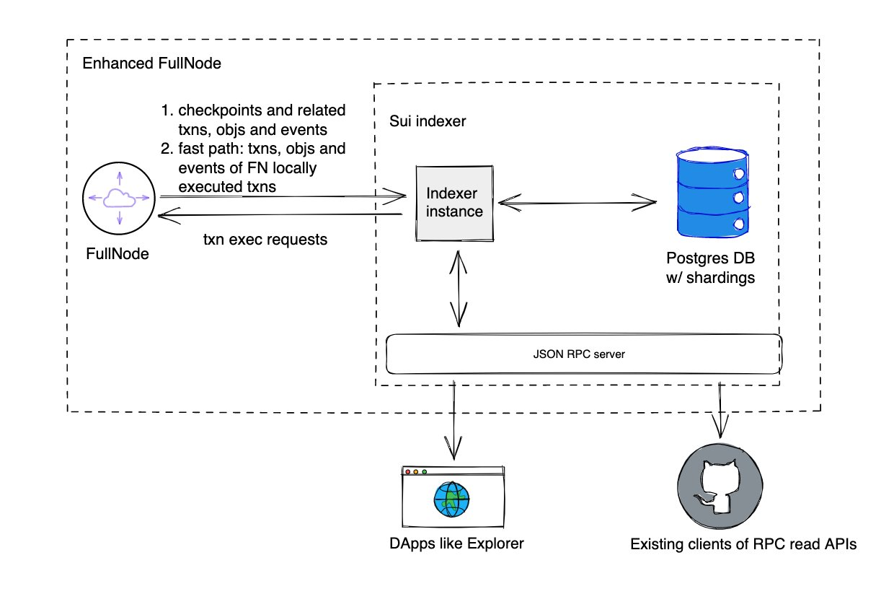

# SUI 钱包开发详细教程

# 一. SUI 简介

SUI 是一个一层区块链平台，目标是解决传统区块链在性能和可扩展性方面的瓶颈。SUI 项目由 Mysten Labs 开发，采用了一些创新的技术和设计理念，使其在处理速度、交易成本和用户体验方面具有显著优势。

## 1.对象模型

Sui 中存储的基本单位是对象。与许多其他区块链（存储以包含键值存储的账户为中心）不同，Sui 的存储以可通过唯一 ID 在链上寻址的对象为中心。智能合约是一个对象（称为 Sui Move 包），这些智能合约在 Sui 网络上操纵对象：

- Sui Move 包：一组 Sui Move 字节码模块。每个模块都有一个在包含包内唯一的名称。包的链上 ID 和模块名称的组合唯一地标识了模块。当您将智能合约发布到 Sui 时，包是发布的单位。发布包对象后，它是不可变的，永远无法更改或删除。包对象可以依赖于之前发布到 Sui 的其他包对象。
- Sui Move 对象：由 Sui Move 包中的特定 Sui Move 模块控制的类型化数据。每个对象值都是一个结构体，其字段可以包含原始类型（例如整数和地址）、其他对象和非对象结构体。

SUI 使用对象存储模型（Object Storage Model）来管理区块链上的数据。这种模型使得每个对象（如代币、合约等）可以独立管理和操作，从而提高了数据处理的效率和灵活性。

## **2.并行交易处理**

与传统区块链的线性交易处理不同，SUI 支持并行交易处理（Parallel Transaction Processing），允许多个交易同时进行。这大大提高了系统的吞吐量和响应速度。

## **3.Move 智能合约语言**

SUI 采用了 Move 语言来编写智能合约。Move 是一种安全、高效的编程语言，最初由 Facebook 的 Libra 项目开发，专门设计用于数字资产管理和智能合约执行。

## **4.SUI 共识**

Sui 平台依靠委托权益证明（DPoS）来确定处理交易的验证者集

拜占庭容错 (BFT) 共识协议是一个丰富的研究领域。Sui 中即将推出的下一代共识引擎基于**Mysticeti** 协议。该协议针对低延迟和高吞吐量进行了优化，具有一下特点：

- 它允许多个验证者并行提出区块，充分利用网络带宽，并提供抗审查能力。这些是基于 DAG 的共识协议的特点。
- 从 DAG 提交块只需要三轮消息，与 pBFT 相同并符合理论最小值。
- 提交规则允许并行对区块进行投票和认证领导者，从而进一步减少中值和尾部延迟。
- 提交规则还可以容忍不可用的领导者，而不会显著增加提交延迟。

## **5. SUI 代币**

SUI 代币是 SUI 区块链平台的原生加密货币，SUI 代币主要用于交易费用，质押和激励等。

## **6. Sui Indexer**

Sui Indexer 是一个非全节点数据服务，提供来自 Sui 协议的数据，包括链上直接生成的数据，以及衍生数据。



Sui Indexer 提供三个主要功能：

- 将数据从完整节点提取到关系数据库。完整节点上的数据以 BCS 字节的形式存储在嵌入式 RocksDB 中，因此查询功能非常有限。索引器提取检查点 blob 数据，并使用适当的索引将其模式化为各种表（如对象、交易等）。
- 为在线事务处理 (OLTP) RPC 请求提供服务。利用关系数据库中的数据，Sui 索引器将无状态读取器二进制文件旋转为具有接口的 JSON RPC 服务器。
- 分析索引器。除了 OLTP 数据提取和请求之外，索引器还支持一些分析数据提取，如每秒事务数 (TPS) 和每日活跃用户 (DAU) 指标。

# 二. SUI 离线地址生成

```javascript
export function createSuiAddress (mnemonic: string, receiveOrChange: string, addresIndex: string, network: string): any {
  const keyPair = Ed25519Keypair.deriveKeypair(mnemonic, `m/44'/784'/0'/0'/${addresIndex}'`);
  return {
    privateKey: Buffer.from(fromB64(keyPair.export().privateKey)).toString('hex'),
    publicKey: Buffer.from(keyPair.getPublicKey().toBytes()).toString('hex'),
    address: keyPair.getPublicKey().toSuiAddress()
  };
}
```

# 三.  SUI 离线交易签名

```javascript
export async function signSuiTransaction (params): Promise<string> {
  const {
    signObj: { from, decimal, coinRefs, gasBudget, gasPrice, outputs, gasCoins },
    privateKey
  } = params;
  const privkey = new Uint8Array(Buffer.from(privateKey, 'hex'));
  const keypair = Ed25519Keypair.fromSecretKey(privkey);
  const txBytes = await getTxBytes(coinRefs, outputs, decimal, from, gasBudget, gasPrice, gasCoins);
  const signature = getSignature(txBytes, keypair, 0);
  return JSON.stringify([
    toB64(txBytes),
    toB64(signature)
  ]);
}
```

**注意：运行过程中如果代码无法运行，可以联系 The Web3 社区帮助您，联系方式 github 上有。**

# 四.  SUI 钱包开发相关接口

## 1.根据账户地址获取 Objects

- 接口作用：根据用户的地址获取对象
- 接口参数：用户账户
- 请求示范

```bash
curl --location 'https://sui-mainnet-endpoint.blockvision.org' \
--header 'Content-Type: application/json' \
--data '{
  "jsonrpc": "2.0",
  "id": 1,
  "method": "suix_getOwnedObjects",
  "params": [
    "0x0c2cc33528892378afabdb8d6be4ab1ae17c04bee0c9c02d42875dcb2d3557d0"
  ]
}'
```

- 返回值

```json
{
    "jsonrpc": "2.0",
    "result": {
        "data": [
            {
                "data": {
                    "objectId": "0x52fbeb15f827d102511454a2bead3eba90b2abe842d7216c25404622fa1d464c",
                    "version": "226080010",
                    "digest": "EMKATUAsXEou7BjTxfb3mnwdavVGJmBwKpEsxKKLtbam"
                }
            }
        ],
        "nextCursor": "0x52fbeb15f827d102511454a2bead3eba90b2abe842d7216c25404622fa1d464c",
        "hasNextPage": false
    },
    "id": 1
}
```

- objectId：对象 ID
- version：版本号
- digest：digest

## 2. 获取 ReferenceGasPrice

- 接口作用：获取 reference gas price
- 接口参数：无
- 请求示范

```bash
curl --location 'https://sui-mainnet-endpoint.blockvision.org' \
--header 'Content-Type: application/json' \
--data '{
  "jsonrpc": "2.0",
  "id": 1,
  "method": "suix_getReferenceGasPrice",
  "params": []
}'
```

- 返回值

```json
{
    "jsonrpc": "2.0",
    "result": "750",
    "id": 1
}
```

- result 为返回的 ReferenceGasPrice

## 3. 获取账户上所有的 Balance

- 接口作用：获取所有账户的 balance
- 接口参数：账户地址
- 请求示范

```bash
curl --location 'https://sui-mainnet-endpoint.blockvision.org' \
--header 'Content-Type: application/json' \
--data '{
  "jsonrpc": "2.0",
  "id": 1,
  "method": "suix_getAllBalances",
  "params": [
    "0x0c2cc33528892378afabdb8d6be4ab1ae17c04bee0c9c02d42875dcb2d3557d0"
  ]
}'
```

- 返回值

```json
{
    "jsonrpc": "2.0",
    "result": [
        {
            "coinType": "0x2::sui::SUI",
            "coinObjectCount": 1,
            "totalBalance": "7940000000",
            "lockedBalance": {}
        }
    ],
    "id": 1
}
```

- coinType: 币种类别
- coinObjectCount: 币种对象编号
- totalBalance： 总的账户余额
- lockedBalance：锁定的账户余额

## 4.获取账户单币种余额

- 接口作用：获取单账户的余额
- 接口参数：地址和币种类别
- 请求示范

```bash
curl --location 'https://sui-mainnet-endpoint.blockvision.org' \
--header 'Content-Type: application/json' \
--data '{
  "jsonrpc": "2.0",
  "id": 1,
  "method": "suix_getBalance",
  "params": [
    "0x0c2cc33528892378afabdb8d6be4ab1ae17c04bee0c9c02d42875dcb2d3557d0",
    "0x2::sui::SUI"
  ]
}'
```

- 返回值

```json
{
    "jsonrpc": "2.0",
    "result": {
        "coinType": "0x2::sui::SUI",
        "coinObjectCount": 1,
        "totalBalance": "7940000000",
        "lockedBalance": {}
    },
    "id": 1
}
```

- coinType: 币种类别
- coinObjectCount: 币种对象编号
- totalBalance： 总的账户余额
- lockedBalance：锁定的账户余额

## 5. 获取最新的 CheckPoint 序号

- 接口作用：获取最新的 CheckPoint 序号
- 接口参数：无
- 请求示范

```bash
curl --location 'https://sui-mainnet-endpoint.blockvision.org' \
--header 'Content-Type: application/json' \
--data '{
  "jsonrpc": "2.0",
  "id": 1,
  "method": "sui_getLatestCheckpointSequenceNumber",
  "params": []
}'
```

- 返回值

```json
{
    "jsonrpc": "2.0",
    "result": "35892529",
    "id": 1
}
```

- result 是最新的检查点

## 6. 根据 CheckPoint 获取交易 Digest

- 接口作用：根据 CheckPoint 获取交易 Digest
- 接口参数：checkpoint 序号
- 请求示范

```bash
curl --location 'https://sui-mainnet-endpoint.blockvision.org' \
--header 'Content-Type: application/json' \
--data '{
  "jsonrpc": "2.0",
  "id": 1,
  "method": "sui_getCheckpoint",
  "params": [
    "35823487"
  ]
}
'
```

- 返回值

```json
{
    "jsonrpc": "2.0",
    "result": {
        "epoch": "418",
        "sequenceNumber": "35823487",
        "digest": "DeDWqVg8mofVfeMqPg8V7zGrEoBJ7cRTYrzGKckJUGCc",
        "networkTotalTransactions": "1699702503",
        "previousDigest": "H22ZZvU5iKGVHwjp6DqncQrBrfKmhdJKKXC4NfsGKLiX",
        "epochRollingGasCostSummary": {
            "computationCost": "7257150319852",
            "storageCost": "57073173658800",
            "storageRebate": "54071746916616",
            "nonRefundableStorageFee": "546179261784"
        },
        "timestampMs": "1717490439151",
        "transactions": [
            "8v2z6Yptd9gn1stMWj6LVwXDnRNt2G81PnqYsJj9varf",
            "EYKfZoiMvGZVBQswcAorbtnmH5VWxn6CwyaNLdZXEfr8",
            "EpVjMgnXRgpHKEK7yESJ9sSvT5z1SM5S7yWg5ELmK3xt",
            "6HTqRgKEafRujQVwxhtDoUG6TtC9KKFDv63sumM73r7o",
            "2HP4RfcT8fmfmLpNW5hNRJ4u2N9fw4ukZKZoGmaDxdnJ",
            "7AH4Q2Fretz2jy2yw869WLmCVeYxDKUbjdWXrEi5o5vV",
            "4P8TeatgqyT8eCDiB1DuYqVdX3gZY8J3aQhzbdJBAktg",
            "MBaeV6NF29dDNUBn9yg7HPLf9iT1jAGPme7kGtLMC4A",
        ],
        "checkpointCommitments": [],
        "validatorSignature": "tJAgjUWbIHhd/VfBbbiRFmxN0fIkFlrx3J2/FOoGKovjwDtl2jY4WmfDQ6KwfWWy"
    },
    "id": 1
}
```

- transactions 数组里面为交易的 digest

## 7. 根据 Digest 获取  Event

- 接口作用：根据 Digest 获取交易的 Event
- 接口参数：交易的 digest
- 请求示范

```bash
curl --location 'https://sui-mainnet-endpoint.blockvision.org' \
--header 'Content-Type: application/json' \
--data '{
  "jsonrpc": "2.0",
  "id": 1,
  "method": "sui_getEvents",
  "params": [
    "EpVjMgnXRgpHKEK7yESJ9sSvT5z1SM5S7yWg5ELmK3xt"
  ]
}'
```

- 返回值

```json
{
    "jsonrpc": "2.0",
    "result": [
        {
            "id": {
                "txDigest": "EpVjMgnXRgpHKEK7yESJ9sSvT5z1SM5S7yWg5ELmK3xt",
                "eventSeq": "0"
            },
            "packageId": "0x1efaf509c9b7e986ee724596f526a22b474b15c376136772c00b8452f204d2d1",
            "transactionModule": "game",
            "sender": "0x272bc90cd3014032af1c79659984e8635bdeff6a4d8cf04b15ff7c5f2bafa0a4",
            "type": "0x1efaf509c9b7e986ee724596f526a22b474b15c376136772c00b8452f204d2d1::game::ClaimToken",
            "parsedJson": {
                "amount_ref1_received": "375000000",
                "amount_ref2_received": "93750000",
                "amount_user_received": "1875000000",
                "amount_village_received": "0",
                "ref1_address": "0x2d1139976d984737aed2c8933b4b541bd0455dbd5c7e42976d57fc8ac15c7d31",
                "ref2_address": "0x6e3660578803fb66b3c95e6b47adf12b8ea958ef231ee543c493092facb756cd",
                "user_address": "0x272bc90cd3014032af1c79659984e8635bdeff6a4d8cf04b15ff7c5f2bafa0a4",
                "village_id": ""
            },
            "bcs": "Jh9Yp5hdR2rof4ReQKGvFWUACG3G2YSE3xFW32q2cQRvuCck81hU7BjwXLWegohcViEMjf3PTvnD3zcUP45wFyPJ8jUgjJL1Pottj93NDGNLDCNYAL8N4A7o7PKkoAvfzyaJpSYSCM53koXD1MS1mpmqC9iH2FFLRwrthyXr6u4XJx71"
        }
    ],
    "id": 1
}
```

- ref1_address：第一个收款地址
- ref2_address：第二个收款地址
- user_address：用户对象交易地址
- amount_ref1_received：第一个地址收到的资金
- amount_ref2_received：第二个地址收到的资金
- amount_user_received：用户地址收到的资金
- sender：发送地址

## 8. 根据 Digest 获取完整的交易

- 接口作用：根据 Digest 获取交易的 Event
- 接口参数：交易的 digest，其他为可选择显示参数
- 请求示范

```bash
curl --location 'https://sui-mainnet-endpoint.blockvision.org' \
--header 'Content-Type: application/json' \
--data '{
    "jsonrpc": "2.0",
    "id": 1,
    "method": "sui_getTransactionBlock",
    "params": [
        "EpVjMgnXRgpHKEK7yESJ9sSvT5z1SM5S7yWg5ELmK3xt",
        {
            "showInput": true,
            "showRawInput": false,
            "showEffects": true,
            "showEvents": true,
            "showObjectChanges": false,
            "showBalanceChanges": false,
            "showRawEffects": false
        }
    ]
}'
```

- 返回值

```json
{
    "jsonrpc": "2.0",
    "result": {
        "digest": "EpVjMgnXRgpHKEK7yESJ9sSvT5z1SM5S7yWg5ELmK3xt",
        "transaction": {
            "data": {
                "messageVersion": "v1",
                "transaction": {
                    "kind": "ProgrammableTransaction",
                    "inputs": [
                        {
                            "type": "object",
                            "objectType": "sharedObject",
                            "objectId": "0x4846a1f1030deffd9dea59016402d832588cf7e0c27b9e4c1a63d2b5e152873a",
                            "initialSharedVersion": "87426356",
                            "mutable": true
                        },
                        {
                            "type": "object",
                            "objectType": "sharedObject",
                            "objectId": "0x0000000000000000000000000000000000000000000000000000000000000006",
                            "initialSharedVersion": "1",
                            "mutable": false
                        }
                    ],
                    "transactions": [
                        {
                            "MoveCall": {
                                "package": "0x2c68443db9e8c813b194010c11040a3ce59f47e4eb97a2ec805371505dad7459",
                                "module": "game",
                                "function": "claim",
                                "arguments": [
                                    {
                                        "Input": 0
                                    },
                                    {
                                        "Input": 1
                                    }
                                ]
                            }
                        }
                    ]
                },
                "sender": "0x272bc90cd3014032af1c79659984e8635bdeff6a4d8cf04b15ff7c5f2bafa0a4",
                "gasData": {
                    "payment": [
                        {
                            "objectId": "0x15ab41f97185e90e9381a4996cce06707cf224e2a9c5f6d3aff783a9bb83d0bc",
                            "version": 226456809,
                            "digest": "HB9X3Jv4MhiRM2TbTR1E5QMu7pRTwnNJi6PUUdSxNQE8"
                        }
                    ],
                    "owner": "0x50fd49dee94571eefc0780fad7141b2a0c2a5ae451b0f9256e18411b23dd142d",
                    "price": "750",
                    "budget": "6576040"
                }
            },
            "txSignatures": [
                "ALCjkzbz4NyeGhmfQ6KU56DDkeoCda8KSKR/HCv2GJ/migdlYFnpHZzAGb11XPTaAbmTjZu+ZLUget5bsCWEDwEkmhVD/Vay2HNwLfwnUs34pt5Cu5wbQLlnkYQvi69stA==",
                "APVpIIRiQjbcMtDNjSzSH9V/FVunhJ+BZDswJmcHYStFdOuQAhZMTf8ZekK7jDTIAVBPd5AIpcyZU01zjSyO9g6Vh97WAMNqH8hZnS5gle+PT+4xDLh3AjSJ+ep76kLqIg=="
            ]
        },
        "effects": {
            "messageVersion": "v1",
            "status": {
                "status": "success"
            },
            "executedEpoch": "418",
            "gasUsed": {
                "computationCost": "750000",
                "storageCost": "9720400",
                "storageRebate": "5650524",
                "nonRefundableStorageFee": "57076"
            },
            "modifiedAtVersions": [
                {
                    "objectId": "0x15ab41f97185e90e9381a4996cce06707cf224e2a9c5f6d3aff783a9bb83d0bc",
                    "sequenceNumber": "226456809"
                },
                {
                    "objectId": "0x4846a1f1030deffd9dea59016402d832588cf7e0c27b9e4c1a63d2b5e152873a",
                    "sequenceNumber": "226724030"
                },
                {
                    "objectId": "0xe2f283acf18491d3d44cfe8ffdf1ac42079b0da6658c872912d60e7c6e2c8e50",
                    "sequenceNumber": "226375400"
                }
            ],
            "sharedObjects": [
                {
                    "objectId": "0x4846a1f1030deffd9dea59016402d832588cf7e0c27b9e4c1a63d2b5e152873a",
                    "version": 226724030,
                    "digest": "APaUgknSPKdMvRj6hkCkuKwcs5wKB3dZLcJ69scvaySg"
                },
                {
                    "objectId": "0x0000000000000000000000000000000000000000000000000000000000000006",
                    "version": 35823488,
                    "digest": "Hgzqbpjd3MWHxXn9yovoM4VrPUwPMdpntDf1STypqHPQ"
                }
            ],
            "transactionDigest": "EpVjMgnXRgpHKEK7yESJ9sSvT5z1SM5S7yWg5ELmK3xt",
            "created": [
                {
                    "owner": {
                        "AddressOwner": "0x272bc90cd3014032af1c79659984e8635bdeff6a4d8cf04b15ff7c5f2bafa0a4"
                    },
                    "reference": {
                        "objectId": "0x40b477679efee484564d093194cb4912607e34b0b44c3a5a0ba6e86024250d73",
                        "version": 226724031,
                        "digest": "5Re8G7FHWGjAWrh3jhgxCu28MhgfAxY2d2smhAg4zDYB"
                    }
                },
                {
                    "owner": {
                        "AddressOwner": "0x6e3660578803fb66b3c95e6b47adf12b8ea958ef231ee543c493092facb756cd"
                    },
                    "reference": {
                        "objectId": "0x4b8041ed9abc4351159192f4dbdae29702e638177ba1d56c7f597364f2dd3e09",
                        "version": 226724031,
                        "digest": "2a6338VGsnhLrwmJRQ96PQABVKxRg3sMwH3GLmyP4mTE"
                    }
                },
                {
                    "owner": {
                        "AddressOwner": "0x2d1139976d984737aed2c8933b4b541bd0455dbd5c7e42976d57fc8ac15c7d31"
                    },
                    "reference": {
                        "objectId": "0x6daf9dcbda8181317f7562c16de1316376f548973a4f604deba3186913f3ab1f",
                        "version": 226724031,
                        "digest": "BDnrghpRjdB4a3ghNKJwaJuoVftjy3t2tUwLSqYkzQvt"
                    }
                }
            ],
            "mutated": [
                {
                    "owner": {
                        "AddressOwner": "0x50fd49dee94571eefc0780fad7141b2a0c2a5ae451b0f9256e18411b23dd142d"
                    },
                    "reference": {
                        "objectId": "0x15ab41f97185e90e9381a4996cce06707cf224e2a9c5f6d3aff783a9bb83d0bc",
                        "version": 226724031,
                        "digest": "fsYPj325CP1xNKUage9VZDXzTCKC3hh6tRT8YrsHGgo"
                    }
                },
                {
                    "owner": {
                        "Shared": {
                            "initial_shared_version": 87426356
                        }
                    },
                    "reference": {
                        "objectId": "0x4846a1f1030deffd9dea59016402d832588cf7e0c27b9e4c1a63d2b5e152873a",
                        "version": 226724031,
                        "digest": "GwhZD8nXUujFwBaR2uMR3yjfzV8QP1j7TdS6vpEJPfwj"
                    }
                },
                {
                    "owner": {
                        "ObjectOwner": "0xb77350ddb66dda28fb70ec8c264397a2ab5e43c0be606f8f2f151be801094549"
                    },
                    "reference": {
                        "objectId": "0xe2f283acf18491d3d44cfe8ffdf1ac42079b0da6658c872912d60e7c6e2c8e50",
                        "version": 226724031,
                        "digest": "CLa7dK6fKsicPAcTF8wxKbgrYHo4cEKvz3ANkqpxMrTB"
                    }
                }
            ],
            "gasObject": {
                "owner": {
                    "AddressOwner": "0x50fd49dee94571eefc0780fad7141b2a0c2a5ae451b0f9256e18411b23dd142d"
                },
                "reference": {
                    "objectId": "0x15ab41f97185e90e9381a4996cce06707cf224e2a9c5f6d3aff783a9bb83d0bc",
                    "version": 226724031,
                    "digest": "fsYPj325CP1xNKUage9VZDXzTCKC3hh6tRT8YrsHGgo"
                }
            },
            "eventsDigest": "AhiTZvZroQv5qn5xDDmCkNKWTaYw5JETZ1qGiS4rwUsv",
            "dependencies": [
                "2oTfzPBR3m7zWDzvGP3XhWzfSd7SGdA4ooRYL8ztv659",
                "3iMUQPuRz5BmBdbgN9wY8zEntAbT1jpfgAWVvEEhuogY",
                "8v2z6Yptd9gn1stMWj6LVwXDnRNt2G81PnqYsJj9varf",
                "EYKfZoiMvGZVBQswcAorbtnmH5VWxn6CwyaNLdZXEfr8"
            ]
        },
        "events": [
            {
                "id": {
                    "txDigest": "EpVjMgnXRgpHKEK7yESJ9sSvT5z1SM5S7yWg5ELmK3xt",
                    "eventSeq": "0"
                },
                "packageId": "0x1efaf509c9b7e986ee724596f526a22b474b15c376136772c00b8452f204d2d1",
                "transactionModule": "game",
                "sender": "0x272bc90cd3014032af1c79659984e8635bdeff6a4d8cf04b15ff7c5f2bafa0a4",
                "type": "0x1efaf509c9b7e986ee724596f526a22b474b15c376136772c00b8452f204d2d1::game::ClaimToken",
                "parsedJson": {
                    "amount_ref1_received": "375000000",
                    "amount_ref2_received": "93750000",
                    "amount_user_received": "1875000000",
                    "amount_village_received": "0",
                    "ref1_address": "0x2d1139976d984737aed2c8933b4b541bd0455dbd5c7e42976d57fc8ac15c7d31",
                    "ref2_address": "0x6e3660578803fb66b3c95e6b47adf12b8ea958ef231ee543c493092facb756cd",
                    "user_address": "0x272bc90cd3014032af1c79659984e8635bdeff6a4d8cf04b15ff7c5f2bafa0a4",
                    "village_id": ""
                },
                "bcs": "Jh9Yp5hdR2rof4ReQKGvFWUACG3G2YSE3xFW32q2cQRvuCck81hU7BjwXLWegohcViEMjf3PTvnD3zcUP45wFyPJ8jUgjJL1Pottj93NDGNLDCNYAL8N4A7o7PKkoAvfzyaJpSYSCM53koXD1MS1mpmqC9iH2FFLRwrthyXr6u4XJx71"
            }
        ],
        "timestampMs": "1717490439151",
        "checkpoint": "35823487"
    },
    "id": 1
}
```

- Event 里面 ref1_address：第一个收款地址
- Event 里面 ref2_address：第二个收款地址
- Event 里面 user_address：用户对象交易地址
- Event 里面 amount_ref1_received：第一个地址收到的资金
- Event 里面 amount_ref2_received：第二个地址收到的资金
- Event 里面 amount_user_received：用户地址收到的资金
- Event 里面 sender：发送地址

## 9. 发送交易到区块链网络

- 接口作用：发送交易到区块链网络
- 接口参数：已签名的交易
- 请求示范

```bash
curl --location 'https://sui-mainnet-endpoint.blockvision.org' \
--header 'Content-Type: application/json' \
--data '{
  "jsonrpc": "2.0",
  "id": 1,
  "method": "sui_dryRunTransactionBlock",
  "params": ["AAACAAgA8gUqAQAAAAAgFS3TCUSw/wiAMoYKAKRyB5PbbmBxvG15QOf9at3BjJECAgABAQAAAQEDAAAAAAEBAAwswzUoiSN4r6vbjWvkqxrhfAS+4MnALUKHXcstNVfQAVL76xX4J9ECURRUor6tPrqQsqvoQtchbCVARiL6HUZMCrV5DQAAAAAgxlwVTy9h/0flFXfbyFPJAoEAsNHlDqJr0vlNBOTfO9YMLMM1KIkjeK+r241r5Ksa4XwEvuDJwC1Ch13LLTVX0PgkAQAAAAAAgBe0LAAAAAAA","AKYc9Gvx3uA0dVq1ktiACBeeW41yc78nNlnQIP/BKjezxY4y+LthAWEFeEATG3R3QWQ0g7H6PGE2WGHBybNTUQicmvF8J3gThGPCIcsztROQWFG2bZE5ge8ew8Qua8XCVg=="]
}'
```

- 返回值

```json
{
    "jsonrpc": "2.0",
    "result": {
        "effects": {
            "messageVersion": "v1",
            "status": {
                "status": "success"
            },
            "executedEpoch": "419",
            "gasUsed": {
                "computationCost": "75000000",
                "storageCost": "1976000",
                "storageRebate": "978120",
                "nonRefundableStorageFee": "9880"
            },
            "modifiedAtVersions": [
                {
                    "objectId": "0x52fbeb15f827d102511454a2bead3eba90b2abe842d7216c25404622fa1d464c",
                    "sequenceNumber": "226080010"
                }
            ],
            "transactionDigest": "8v7p7tTz9Hn4sToh6eopoen4nVp46wg93W5KLM6a28zD",
            "created": [
                {
                    "owner": {
                        "AddressOwner": "0x152dd30944b0ff088032860a00a4720793db6e6071bc6d7940e7fd6addc18c91"
                    },
                    "reference": {
                        "objectId": "0xb7db9af7038885b8b17d7f6b499208881df66ede394cf5fc09e525ff2adb4b60",
                        "version": 226080011,
                        "digest": "4yk8oM8GUNKbyFWfqtoTadN34AzGayU3zmqcE8Bqu5ir"
                    }
                }
            ],
            "mutated": [
                {
                    "owner": {
                        "AddressOwner": "0x0c2cc33528892378afabdb8d6be4ab1ae17c04bee0c9c02d42875dcb2d3557d0"
                    },
                    "reference": {
                        "objectId": "0x52fbeb15f827d102511454a2bead3eba90b2abe842d7216c25404622fa1d464c",
                        "version": 226080011,
                        "digest": "A7K5J8JRm4wQtyvcwDS23P3ZpFAN119VwVxGSCBBpf1W"
                    }
                }
            ],
            "gasObject": {
                "owner": {
                    "AddressOwner": "0x0c2cc33528892378afabdb8d6be4ab1ae17c04bee0c9c02d42875dcb2d3557d0"
                },
                "reference": {
                    "objectId": "0x52fbeb15f827d102511454a2bead3eba90b2abe842d7216c25404622fa1d464c",
                    "version": 226080011,
                    "digest": "A7K5J8JRm4wQtyvcwDS23P3ZpFAN119VwVxGSCBBpf1W"
                }
            },
            "dependencies": [
                "G4NwGYPCp3RUh7dNdNqFANCbmM6ZSFf4AAqLRTaEB5FJ"
            ]
        },
        "events": [],
        "objectChanges": [
            {
                "type": "mutated",
                "sender": "0x0c2cc33528892378afabdb8d6be4ab1ae17c04bee0c9c02d42875dcb2d3557d0",
                "owner": {
                    "AddressOwner": "0x0c2cc33528892378afabdb8d6be4ab1ae17c04bee0c9c02d42875dcb2d3557d0"
                },
                "objectType": "0x2::coin::Coin<0x2::sui::SUI>",
                "objectId": "0x52fbeb15f827d102511454a2bead3eba90b2abe842d7216c25404622fa1d464c",
                "version": "226080011",
                "previousVersion": "226080010",
                "digest": "A7K5J8JRm4wQtyvcwDS23P3ZpFAN119VwVxGSCBBpf1W"
            },
            {
                "type": "created",
                "sender": "0x0c2cc33528892378afabdb8d6be4ab1ae17c04bee0c9c02d42875dcb2d3557d0",
                "owner": {
                    "AddressOwner": "0x152dd30944b0ff088032860a00a4720793db6e6071bc6d7940e7fd6addc18c91"
                },
                "objectType": "0x2::coin::Coin<0x2::sui::SUI>",
                "objectId": "0xb7db9af7038885b8b17d7f6b499208881df66ede394cf5fc09e525ff2adb4b60",
                "version": "226080011",
                "digest": "4yk8oM8GUNKbyFWfqtoTadN34AzGayU3zmqcE8Bqu5ir"
            }
        ],
        "balanceChanges": [
            {
                "owner": {
                    "AddressOwner": "0x0c2cc33528892378afabdb8d6be4ab1ae17c04bee0c9c02d42875dcb2d3557d0"
                },
                "coinType": "0x2::sui::SUI",
                "amount": "-5075997880"
            },
            {
                "owner": {
                    "AddressOwner": "0x152dd30944b0ff088032860a00a4720793db6e6071bc6d7940e7fd6addc18c91"
                },
                "coinType": "0x2::sui::SUI",
                "amount": "5000000000"
            }
        ],
        "input": {
            "messageVersion": "v1",
            "transaction": {
                "kind": "ProgrammableTransaction",
                "inputs": [
                    {
                        "type": "pure",
                        "valueType": "u64",
                        "value": "5000000000"
                    },
                    {
                        "type": "pure",
                        "valueType": "address",
                        "value": "0x152dd30944b0ff088032860a00a4720793db6e6071bc6d7940e7fd6addc18c91"
                    }
                ],
                "transactions": [
                    {
                        "SplitCoins": [
                            "GasCoin",
                            [
                                {
                                    "Input": 0
                                }
                            ]
                        ]
                    },
                    {
                        "TransferObjects": [
                            [
                                {
                                    "NestedResult": [
                                        0,
                                        0
                                    ]
                                }
                            ],
                            {
                                "Input": 1
                            }
                        ]
                    }
                ]
            },
            "sender": "0x0c2cc33528892378afabdb8d6be4ab1ae17c04bee0c9c02d42875dcb2d3557d0",
            "gasData": {
                "payment": [
                    {
                        "objectId": "0x52fbeb15f827d102511454a2bead3eba90b2abe842d7216c25404622fa1d464c",
                        "version": 226080010,
                        "digest": "EMKATUAsXEou7BjTxfb3mnwdavVGJmBwKpEsxKKLtbam"
                    }
                ],
                "owner": "0x0c2cc33528892378afabdb8d6be4ab1ae17c04bee0c9c02d42875dcb2d3557d0",
                "price": "75000",
                "budget": "750000000"
            }
        }
    },
    "id": 1
}
```

- transactionDigest：交易的 Hash

# **五. 中心化钱包开发**

## **1. 离线地址生成**

- 调度签名机生成密钥对，签名机吐出公钥
- 使用公钥匙导出地址

## **2.充值逻辑**

- 获得最新块高；更新到数据库
- 从数据库中获取上次解析交易的块高做为起始块高，最新块高为截止块高，如果数据库中没有记录，说明需要从头开始扫，起始块高为 0；
- 解析区块里面的交易，to 地址是系统内部的用户地址，说明用户充值，更新交易到数据库中，将交易的状态设置为待确认。
- 所在块的交易过了确认位，将交易状态更新位充值成功并通知业务层。

## **3. 提现逻辑**

- 获取离线签名需要的参数，给合适的手续费
- 构建未签名的交易消息摘要，将消息摘要递给签名机签名
- 构建完整的交易并进行序列化
- 发送交易到区块链网络
- 扫链获取到交易之后更新交易状态并上报业务层

## **4.归集逻辑**

- 将用户地址上的资金转到归集地址，签名流程类似提现
- 发送交易到区块链网络
- 扫链获取到交易之后更新交易状态

## **5. 转冷逻辑**

- 将热钱包地址上的资金转到冷钱包地址，签名流程类似提现
- 发送交易到区块链网络
- 扫链获取到交易之后更新交易状态

## **6.冷转热逻辑**

- 手动操作转账到热钱包地址
- 扫链获取到交易之后更新交易状态

# **六 HD 钱包开发**

## **1.离线地生成和离线签名**

参考上面的代码

## **2.和链上交互的接口**

- 获取账户余额
- 获取 nonce
- 根据地址获取交易记录
- 获取预估手续费

# **七. 总结**

HD 钱包和交易所钱包不同之处有以下几点

## **1.密钥管理方式不同**

- HD 钱包私钥在本地设备，私钥用户自己控制
- 交易所钱包中心化服务器(CloadHSM, TEE 等)，私钥项目方控制

## **2.资金存在方式不同**

- HD 资金在用户钱包地址
- 交易所钱包资金在交易所热钱包或者冷钱包里面, 用户提现的时候从交易所热钱包提取

## **3.业务逻辑不一致**

- 中心化钱包：实时不断扫链更新交易数据和状态
- HD 钱包：根据用户的操作通过请求接口实现业务逻辑

# **八.附录**

- Sui 代币精度： 9

- Github:  https://github.com/MystenLabs

- Sui docs:  https://docs.sui.io/

- Sui 接口文档: https://docs.sui.io/sui-api-ref#suix_getallbalances

- Sui 浏览器:

  https://suiscan.xyz/

  https://suivision.xyz/

- Typescript: https://sdk.mystenlabs.com/typescript/install